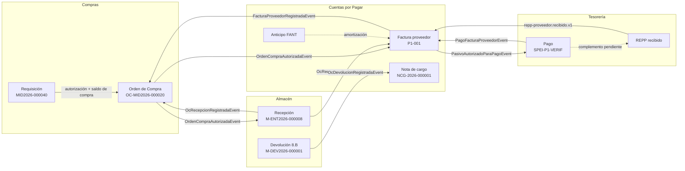

# Paquete de entrega funcional — Egresos e ingresos del back-office

Este paquete documenta, con evidencia real de la verificación end-to-end contra
el ambiente **dev** (vía API real), las dos cadenas completas del back-office:

> **Egresos (2026-07-15):** Requisiciones → Compras (OC) → Almacén → Cuentas por Pagar → Tesorería
>
> **Ingresos (2026-07-17/18):** Facturación (CFDI) → Cuentas por Cobrar → Tesorería

Los folios que aparecen en los guiones (RQ `MID2026-000040`, `OC-MID2026-000020/21`,
`M-ENT2026-000008/9`, facturas `P1-001`/`P2-001`, `NCG-2026-000001`, pago
`SPEI-P1-VERIF`; y del lado de ingresos `VEN-*`, `FACANT-*`, `NCRED-*`, etc.)
**existen en dev** y están etiquetados como "P… verificacion pipeline (prueba Claude)".

## Mapa del paquete

### Guiones de pipeline ([pipelines/](pipelines/))

| Guion | Flujo | Evidencia principal |
|---|---|---|
| [P1 — Flujo feliz insumos (variante A)](pipelines/p1-flujo-feliz-insumos.md) | RQ → OC → recepción con CFDI → factura 3-way → autorización → pago → REPP | `MID2026-000040`, `OC-MID2026-000020`, `M-ENT2026-000008`, factura `P1-001`, pago `SPEI-P1-VERIF` |
| [P2 — Materiales directos (variante B)](pipelines/p2-materiales-directos.md) | OC directa sin RQ → packing list → factura posterior concilia | `OC-MID2026-000021`, `M-ENT2026-000009`, factura `P2-001` |
| [P3 — Devolución a proveedor (8.B)](pipelines/p3-devolucion-proveedor.md) | Devolución → nota de cargo → NC fiscal rel. 03 → conciliación | `M-DEV2026-000001`, `NCG-2026-000001` |
| [P4 — Rechazo por tolerancia](pipelines/p4-rechazo-tolerancia.md) | Factura excede tolerancia → rechazo → evento a Compras | diferencia de precio real vs OC |
| [P5 — Anticipos](pipelines/p5-anticipos.md) | Anticipo FANT → aplicación a factura → saldo neto | `ANT-P5` amortizado contra `P2-001` |
| [P6 — Flujos internos de Almacén](pipelines/p6-flujos-internos-almacen.md) | Salida con RQ, vale urgente, devolución interna 8.A, conteo con ajuste | `M-SAL2026-000004/5`, `M-DEV2026-000002`, `M-AJN2026-000001` |
| [P7 — Gastos internos de CxP](pipelines/p7-cxp-gastos-internos.md) | Comprobaciones (caja chica/aduanales), viáticos, tarjetas de crédito | ⚠️ sin evidencia e2e |
| [P8 — Reabasto y cierre de mes de Almacén](pipelines/p8-almacen-reabasto-cierre.md) | Motor de reorden (RQ de sistema) y cierre de periodo | ⚠️ sin evidencia e2e |
| [P9 — Jornada del cajero (ingresos)](pipelines/p9-cajero-facturacion-tesoreria.md) | Apertura de caja → facturas mostrador (sin/con ranura, anticipos, PPD+REPP) → cierre → Tesorería; ruta bancaria CxC → depósito → REPP automático | `VEN-000009..17`, `FACANT-2026-000006/7/8`, `NCRED-2026-000005..8`, `SPEI-P9-VERIF-001` |
| [P10 — Facturación multimoneda (MXN/USD)](pipelines/p10-facturacion-multimoneda-cce-obra.md) | Mismo motor Facturación→CxC→Tesorería en MXN (mostrador/obra) y USD (exportación CCE 0% IVA), con Carta Porte, anticipos únicos/múltiples y REPP; correlación de XML documentada | `VEN-000024/25`, `VEN-000093/94/95/96/97/98`, `VEN-000056` (Carta Porte), `FACANT-2026-000009..12` |

P1–P6 corresponden a los pipelines ejecutados en la verificación e2e de la
cadena de egresos; P7 y P8 documentan los flujos internos de control de cada
módulo. **P9 (2026-07-17) abre la cadena de ingresos** (Facturación desde la
vista del cajero hasta Tesorería) y **P10 (2026-07-18) la extiende a
multimoneda** (MXN mostrador/obra + USD exportación con Comercio Exterior,
Carta Porte y anticipos múltiples), ambos ejecutados e2e vía API real en dev.
Cada ficha `-usuario` incluye
además una sección "Flujos internos de control" con los controles menores
(catálogos, reservas, reversas, partidas abiertas, etc.).

> 📄 **Cómo leer los XML timbrados** (ligas entre factura, notas de crédito,
> complemento de pago y traslado): [manual-correlacion-cfdi.md](manual-correlacion-cfdi.md).

### Fichas por módulo ([modulos/](modulos/))

| Módulo | Ficha de usuario | Ficha de administración |
|---|---|---|
| Requisiciones | [requisiciones-usuario.md](modulos/requisiciones-usuario.md) | [requisiciones-admin.md](modulos/requisiciones-admin.md) |
| Órdenes de Compra | [ordenes-compra-usuario.md](modulos/ordenes-compra-usuario.md) | [ordenes-compra-admin.md](modulos/ordenes-compra-admin.md) |
| Almacén | [almacen-usuario.md](modulos/almacen-usuario.md) | [almacen-admin.md](modulos/almacen-admin.md) |
| Cuentas por Pagar | [cuentas-por-pagar-usuario.md](modulos/cuentas-por-pagar-usuario.md) | [cuentas-por-pagar-admin.md](modulos/cuentas-por-pagar-admin.md) |
| Facturación | [facturacion-usuario.md](modulos/facturacion-usuario.md) | [facturacion-admin.md](modulos/facturacion-admin.md) |
| Cuentas por Cobrar | [cuentas-por-cobrar-usuario.md](modulos/cuentas-por-cobrar-usuario.md) | [cuentas-por-cobrar-admin.md](modulos/cuentas-por-cobrar-admin.md) |
| Tesorería | [tesoreria-usuario.md](modulos/tesoreria-usuario.md) | [tesoreria-admin.md](modulos/tesoreria-admin.md) |

Las fichas **-usuario** están dirigidas a operadores (comprador, jefe de almacén,
auxiliar de CxP, tesorero); las **-admin** a administración/TI (permisos,
configuración previa, eventos, monitoreo, límites conocidos).

## La cadena y sus eventos

El detalle de cada evento (quién publica, quién consume, reglas de oro de la
triada) está en [CLAUDE.md](../../CLAUDE.md) y en las fichas -admin de cada módulo.

## Cómo usar este paquete

1. **Capacitación de operadores**: empezar por la ficha `-usuario` del módulo
   que corresponda y después recorrer el guion de pipeline P1 de punta a punta.
2. **Puesta en marcha de un ambiente**: seguir la sección "Configuración previa
   obligatoria" de cada ficha `-admin` **antes** de intentar los guiones; los
   guiones asumen esa configuración hecha.
3. **Soporte / troubleshooting**: sección "Monitoreo y troubleshooting" de las
   fichas `-admin` y las secciones "Variantes y errores esperados" de cada guion.

## Estado de hallazgos de la verificación (2026-07-15)

- **Corregidos** (#610, #611, #612): conciliación comparaba total de OC sin IVA
  contra factura con IVA; el listener de Compras no toleraba PascalCase y el
  sub-estado Facturación no avanzaba; el estado `ConciliadaConNcFiscal` era
  inalcanzable por un check constraint y el filtro de Service Bus no incluía la
  NC fiscal.
- **Corregidos después** (#613–#617, #619): el sub-estado **Pago** de la OC ya
  avanza (CxP re-publica `factura.pago-aplicado.v1` con el acumulado pagado
  por OC y Compras lo consume) y la OC **cierra automáticamente** al completar
  los 3 sub-estados (#613/#614); la devolución 8.B ya decrementa
  `CantidadRecibida` por línea y reabre la OC si estaba cerrada (GAP-5,
  #614/#615); la salida física de la devolución drena la ubicación real vía
  selector de bins (GAP-4, #615); CxP ya emite el evento de diferencia de
  precio dentro de tolerancia y Almacén re-valoriza el remanente (GAP-3,
  #617); las OCs de servicio cierran con `EsServicio` sin exigir recepción
  (GAP-9, #619).
- **Abiertos** (hallazgos menores): crear una RQ con sucursal sin
  departamentos truena con error 500; la bandera `factura_pendiente` de la
  proyección local de Almacén no se apaga al conciliar (no afecta saldos);
  la NC de proveedor sigue sin granularidad por línea de OC
  (PLATFORM-TODO `<NcGranularidadLineaOc>`).
