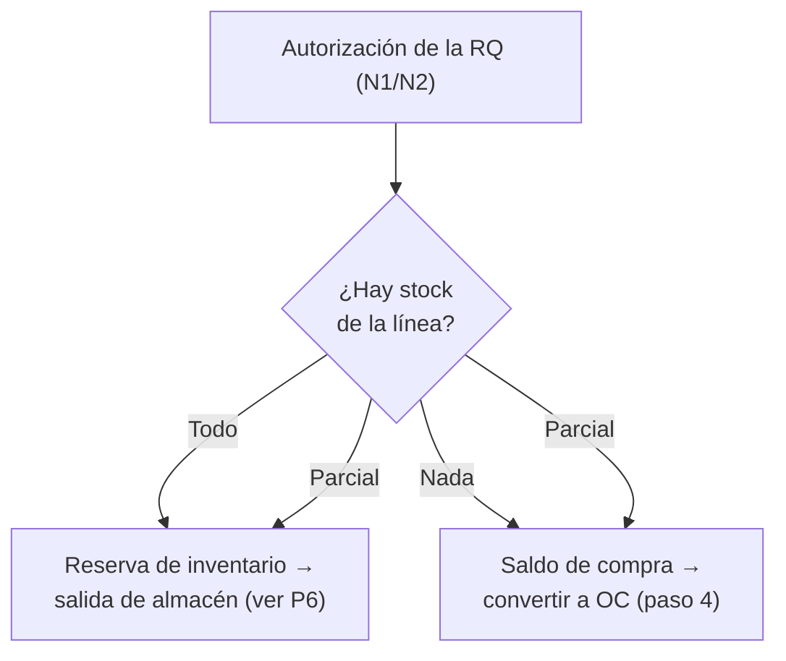

# P1 — Flujo feliz de insumos (recepción variante A)

**Cadena completa:** Requisición → Orden de Compra → Recepción con CFDI →
Factura con conciliación 3-way → Autorización del pasivo → Pago → REPP.

**Evidencia en dev (2026-07-15):** RQ `MID2026-000040` · OC `OC-MID2026-000020` ·
recepción `M-ENT2026-000008` · factura `P1-001` ($1,350.00) · pago `SPEI-P1-VERIF` ·
REPP registrado.

## Objetivo de negocio

Comprar un insumo o refacción que no hay en stock: el área lo solicita, Compras
lo ordena, Almacén lo recibe junto con la factura del proveedor (variante A:
el proveedor entrega material y CFDI al mismo tiempo), CxP concilia la factura
contra la OC y la recepción (three-way match), y Tesorería paga y vigila que el
proveedor entregue su complemento de pago (REPP).

## Actores y permisos

| Paso | Actor | Permisos requeridos |
|---|---|---|
| Crear y transmitir RQ | Solicitante | `compras.requisiciones.crear`, `.leer` |
| Autorizar RQ | Jefe de departamento (N1) / Autorizador N2 | `compras.requisiciones.autorizar-nivel1` / `.autorizar-nivel2` |
| Crear, adjuntar y transmitir OC | Comprador | `compras.ordenes.crear`, `.adjuntar`, `.leer` |
| Autorizar OC | Jefe de Compras (N1), Dirección (N2) | `compras.ordenes.autorizar-nivel1` / `.autorizar-nivel2` |
| Registrar recepción | Supervisor de Insumos / Almacenista | `almacen.entradas.capturar`, `.registrar`; para ver CFDIs del picker: `cuentas_por_pagar.cfdis.leer` |
| Capturar factura | Auxiliar de CxP | `cuentas_por_pagar.facturas.capturar`, `.leer` |
| Autorizar factura (manual) | Responsable de CxP | `cuentas_por_pagar.facturas.autorizar` |
| Registrar pago | Auxiliar de Tesorería | `tesoreria.pasivos.ver`, `tesoreria.pagos.aplicar` |
| Registrar REPP | Auxiliar de Tesorería | `tesoreria.repp.registrar` |

## Precondiciones (datos maestros y configuración)

Sin esto, el guion falla a la mitad — ver detalle en las fichas `-admin`:

1. **Matriz de aprobadores** del departamento solicitante configurada en
   `/compras/admin/aprobadores` (JefeDpto y, si el monto rebasa el umbral,
   AutorizadorN2), con **umbral de monto por departamento** vigente.
2. **La sucursal tiene departamentos ligados** (hoy, crear una RQ con sucursal
   sin departamentos truena con error 500 — hallazgo menor abierto).
3. **Artículo activo** en el catálogo, con unidad de medida.
4. **Proveedor activo** con datos fiscales; su **tolerancia de conciliación**
   configurada o el default global de **$0.99 MXN** aplicará.
5. **Asignación artículo→ubicación** en `/almacen/asignaciones` para el
   sub-almacén receptor. Sin ella la recepción falla con `ENTRADA_SIN_ASIGNACION`.
6. **CFDI del proveedor disponible**: ingresado al repositorio de CxP
   (`/cxp/cfdis`, carga manual o mailbox) — o el folio fiscal (UUID) a la mano.
7. **Cuenta bancaria de Tesorería** dada de alta (por script seed, no por UI) y
   **datos bancarios del proveedor** en Datos Maestros.

## Pasos

### Fase Compras — Requisición

1. **Crear la RQ.** En `/compras/requisiciones` (pantalla "Bandeja de
   requisiciones"), botón **"Nueva requisición"** → se abre el Sheet lateral.
   Capturar cabecera (sucursal, departamento, requisitante) y agregar líneas con
   el form inline (borde punteado). Botón **"Crear requisición"**. Queda en
   `Borrador` con folio tipo `MID2026-000040`.
   📸 Captura pendiente: Sheet "Nueva requisición".
2. **Transmitir.** En el detalle `/compras/requisiciones/$id`, botón
   **"Transmitir"** → pasa a `EnAutorizacion`.
3. **Autorizar.** El aprobador entra a `/compras/pendientes` ("Pendientes de
   autorización"), abre la RQ y pulsa **"Aprobar Nivel 1"**; si el monto rebasa
   el umbral del departamento, un segundo aprobador pulsa **"Aprobar Nivel 2"**.
   Al autorizar corre la **bifurcación stock-aware**: lo que hay en stock se
   reserva para salida de almacén; el saldo sin stock queda como saldo de compra.
   En P1 no había stock → todo el saldo va a compra y la RQ queda `Autorizada`.
   📸 Captura pendiente: detalle RQ con stepper de autorización.

> La bifurcación corre **por línea**: una misma RQ puede terminar con líneas
> reservadas para salida y líneas en saldo de compra al mismo tiempo.

### Fase Compras — Orden de Compra

4. **Convertir a OC.** Desde el detalle de la RQ autorizada, botón
   **"Convertir a OC"** → abre el Sheet "Nueva OC" en modo 1:1 con las líneas de
   saldo prellenadas. Guardar → OC en `Borrador` con folio `OC-MID2026-000020`.
   La RQ queda comprometida en esa OC (no puede usarse en otra).
5. **Adjuntar la cotización.** En el detalle `/compras/ordenes/$id`, gestor de
   adjuntos: subir documento tipo `cotizacion`. Sin ella (o sin la excepción con
   `correo_autorizacion`), el paso 6 rechaza con `OC_COTIZACION_REQUERIDA`.
6. **Transmitir a autorización.** Botón **"Transmitir a autorización"** →
   `EnAutorizacionJefeCompras`.
7. **Autorizar la OC.** Jefe de Compras: **"Aprobar Nivel 1"**; Dirección:
   **"Aprobar Nivel 2"** → estado `Autorizada`, se genera el PDF al proveedor y
   arrancan los tres sub-estados (Recepción / Facturación / Pago) visibles en la
   barra de sub-estados del detalle y en la "Bandeja de OCs" (`/compras/ordenes`).
   📸 Captura pendiente: detalle OC con SubEstadosBar.

> **Evento emitido:** `OrdenCompraAutorizadaEvent` (Compras → Almacén y CxP).
> Habilita la OC para recepción y para conciliación de factura.

### Fase Almacén — Recepción variante A

8. **Registrar la recepción.** En `/almacen/recepciones` ("Recepciones"), botón
   **"Nueva recepción"** → Sheet "Nueva recepción". Elegir tipo
   **"Con factura/CFDI"** (variante A, para insumos). Seleccionar la OC,
   capturar cantidades recibidas y elegir **ubicación real** del sub-almacén
   (la ÚNICA no acepta entradas). Vincular el CFDI con el **picker "CFDIs por
   procesar de {RFC}"** — acotado al RFC del proveedor de la OC — o, si el XML
   aún no está en el sistema, capturar el **folio fiscal (UUID)** a mano
   (enlace diferido: cuando el CFDI entre al repositorio, se vincula solo).
   Botón **"Registrar recepción"** → movimiento firme `M-ENT2026-000008`.
   📸 Captura pendiente: Sheet "Nueva recepción" variante A con picker de CFDI.

> **Evento emitido:** `OcRecepcionRegistradaEvent` (Almacén → Compras y CxP).
> Compras avanza el sub-estado **Recepción** de la OC; CxP guarda la recepción
> para la conciliación 3-way. El inventario se valúa **al precio de la OC**.

### Fase CxP — Factura y autorización

9. **Capturar la factura.** En `/cxp/facturas` ("Facturas"), botón
   **"Capturar factura"** → Sheet "Capturar factura desde OC": elegir la OC y el
   CFDI del picker de CFDIs por procesar; el sistema prellena conceptos y total.
   Al capturar corre la **conciliación 3-way**: factura vs OC dentro de la
   tolerancia del proveedor (aquí $1,350.00 exactos, diferencia $0). La factura
   `P1-001` queda `Capturada`.
   📸 Captura pendiente: Sheet "Capturar factura desde OC".

> **Evento emitido:** `FacturaProveedorRegistradaEvent` (CxP → Compras y
> Almacén). Compras avanza el sub-estado **Facturación** con los acumulados por
> línea ya calculados por CxP.

10. **Autorizar el pasivo.** La OC autorizada autoriza el pasivo: no se exige
    segunda firma en el flujo estándar. En la pantalla, el botón **"Autorizar"**
    del detalle `/cxp/facturas/$id` ejecuta el paso → estado `Autorizada`.

> **Eventos emitidos:** `FacturaProveedorAutorizadaEvent` (→ Compras,
> Contabilidad) y `PasivoAutorizadoParaPagoEvent` (→ Tesorería), que deja el
> pasivo en la bandeja de pagos con datos bancarios y evidencias.

### Fase Tesorería — Pago y REPP

11. **Registrar el pago.** En `/tesoreria/pagos` ("Pagos a proveedor") aparece
    el pasivo autorizado. Seleccionarlo → botón **"Registrar pago (1)"** → Sheet
    "Registrar pago a proveedor": cuenta bancaria, fecha y referencia
    (evidencia: `SPEI-P1-VERIF`). Botón **"Registrar pago"**.
    📸 Captura pendiente: bandeja de pagos con pasivo seleccionado.

> **Eventos emitidos:** `PagoFacturaProveedorEvent` (Tesorería → CxP), uno
> **por factura** aunque el pago cubra varias. CxP marca la factura `Pagada`
> y re-publica `cuentas_por_pagar.factura.pago-aplicado.v1` con el **acumulado
> pagado por OC** ya calculado (#613); Compras lo consume y avanza el
> sub-estado **Pago** (#614). Cuando Recepción, Facturación y Pago quedan
> Completa, la OC pasa a `Cerrada` **automáticamente** y se emite
> `OrdenCompraCerradaEvent` (→ Requisiciones, que cubre y cierra la RQ).

12. **Registrar el REPP.** El pago PPD aparece en `/tesoreria/repp` ("REPP de
    proveedor") como pago sin complemento, con contador de días (SLA 5 días,
    ⚠ si vencido). Cuando el proveedor envía su complemento: botón
    **"Registrar REPP"** → Sheet "Registrar REPP recibido": UUID del complemento
    y XML. Registrarlo publica `repp-proveedor.recibido.v1`, que **libera el
    motivo `FALTA_REPP`** en CxP.
    📸 Captura pendiente: bandeja "REPP de proveedor".

## Cómo verificar el resultado en cada módulo

| Módulo | Dónde | Qué esperar |
|---|---|---|
| Compras (RQ) | `/compras/requisiciones/$id` | RQ `MID2026-000040` con cubrimiento recibido; `EnSurtido`→`Cerrada` al cubrirse |
| Compras (OC) | `/compras/ordenes` y `/compras/trazabilidad/oc/$id` | `OC-MID2026-000020` con sub-estados Recepción=Completa, Facturación=Completa, Pago=Completa → estado `Cerrada` (cierre automático, #614); árbol de trazabilidad con RQ, recepción y factura |
| Almacén | `/almacen/recepciones/$id` y `/almacen/saldos` | `M-ENT2026-000008` `Registrada` con CFDI vinculado; saldo del artículo incrementado al precio de la OC |
| CxP | `/cxp/facturas/$id` | Factura `P1-001` en `Pagada`, saldo pendiente $0, aplicación del pago visible |
| Tesorería | `/tesoreria/movimientos` | Movimiento de egreso `SPEI-P1-VERIF` aplicado a la factura; en `/tesoreria/repp` el pago ya no aparece como pendiente |

## Variantes y errores esperados

| Situación | Error real (422 salvo indicado) | Mensaje |
|---|---|---|
| Transmitir RQ sin líneas | `TRANSMITIR_SIN_LINEAS` | "La requisición debe tener al menos una línea para enviarse a autorización." |
| Aprobar N2 sin N1 | `AUTORIZACION_NIVEL2_SIN_NIVEL1` | "Nivel2 requiere que primero exista Nivel1." |
| Transmitir OC sin cotización | `OC_COTIZACION_REQUERIDA` | "Antes de enviar a autorización, la OC requiere un adjunto tipo 'cotizacion' o activar CotizacionExcepcionada con correo de autorización." |
| Excepción de cotización sin correo | `OC_EXCEPCION_COTIZACION_SIN_CORREO` | "CotizacionExcepcionada exige un adjunto tipo 'correo_autorizacion'." |
| Proveedor inactivo al transmitir/autorizar OC | `PROVEEDOR_INACTIVO` | "El proveedor '{clave}' está {estatus} y no puede enviarse a autorización." |
| Recepción variante A sin CFDI ni UUID | `RECEPCION_SIN_CFDI` | "La recepción variante A requiere el CFDI vinculado o su folio fiscal (UUID)." |
| Recepción a ubicación sin asignación | `ENTRADA_SIN_ASIGNACION` | "El artículo no está asignado a la ubicación elegida. Asígnalo primero." |
| Recepción a la ubicación ÚNICA | `ENTRADA_A_UBICACION_UNICA` | "Las entradas exigen una ubicación real; la ÚNICA solo se drena por salidas." |
| Factura fuera de tolerancia | — (no es 422) | La factura se crea y se **cancela automáticamente** con motivo `RechazadaPorTolerancia` — ver guion [P4](p4-rechazo-tolerancia.md) |
| Pagar un pasivo que no está en bandeja | `PAGO_PASIVO_NO_AUTORIZADO` | "Pasivo(s) no presentes en la bandeja de autorizados: {faltantes} (RN-1)." |
| Pago con pasivos de dos proveedores | `PAGO_MULTIPROVEEDOR` | "Un pago cubre pasivos de un solo proveedor; registra un pago por proveedor." |
| Registrar dos veces el mismo REPP | `REPP_UUID_DUPLICADO` | "El complemento con UUID '{uuid}' ya está registrado." |
