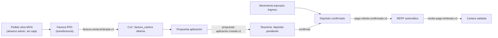
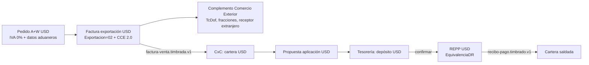

# P10 — Facturación multimoneda: mostrador (MXN) · obra sin caja (MXN) · exportación (USD/CCE), con Carta Porte

**Cadena completa (ingresos, tres tracks):** un mismo motor de Facturación →
CxC → Tesorería recorrido en tres modalidades de cobro/moneda, más el
complemento de Carta Porte como escenario transversal. Cada track ejercita
ranura, anticipos (únicos y múltiples) y REPP según aplique, y termina en
cartera saldada + depósito conciliado en Tesorería.

| Track | Moneda | Cobro | IVA | Ranura | CCE (exportación) | Anticipos | REPP |
|---|---|---|---|---|---|---|---|
| **A — Mostrador** | MXN | Caja (efectivo/tarjeta/transferencia) → cierre | 16 % | ✅ | — | únicos + múltiples | vía cierre → Tesorería |
| **B — Obra / administrativo** | MXN | **Sin caja**, transferencia (alcance admin) → CxC | 16 % | — | — | únicos + múltiples | REPP automático (ruta bancaria) |
| **C — Exportación** | **USD** | **Sin caja**, transferencia → CxC | **0 % (exportación)** | — | ✅ CCE 2.0 | únicos + múltiples | REPP USD (`EquivalenciaDR`) |
| **D — Carta Porte** | MXN | (traslado, sin cobro) | — | — | — | — | — |

> **Estado (2026-07-18): EJECUTADO — los cuatro tracks (A4, B, C, D) + REPP USD
> VERIFICADOS e2e en dev.** Ver §"Ejecución e2e — resultados". Los bloqueos
> P10-H1 (CP107) y P10-H2 (colisión CCE) se cerraron en #670; P10-H4 (CCE122)
> y P10-H5 (CP155) en #671; queda abierto **P10-H3** (race intermitente del
> sandbox de FiscalAPI, se resuelve reintentando). Track C: `VEN-000093`
> (export USD/CCE) + `VEN-000094` (REPP USD); Track D: `VEN-000056` (Carta
> Porte tipo T).

> ✅ **P9-H7 (anticipos múltiples) ya está corregido en `main`** — PR #666
> (`aee5d547`, squash-merge 2026-07-17) rutea cada evento al outbox del schema
> del módulo dueño; PR #667 (`cfce66e3`) agrega cobertura de reintento REPP
> (P9-H3). Los escenarios A4/B3/C3 pasan de "bloqueados" a **verificación de
> regresión** del fix. `main` @ `cfce66e3`.
>
> ✅ **Endpoints XML de REPP y Carta Porte agregados** (rama
> `facturacion/p10-multimoneda`): `GET /api/v1/facturacion/repp/{id}/xml` y
> `GET /api/v1/facturacion/carta-porte/{id}/xml`, reusando `ComprobanteXmlQuery`
> (que ya soportaba ambas familias). El manual ya puede bajar los 5 tipos de XML
> por endpoint homogéneo.
>
> ⚠️ **Prerrequisito que aún bloquea la ejecución** (ver §Prerrequisitos técnicos):
> **Sembrar datos USD/CCE y catálogos de Carta Porte** en dev (no existen).

> ⚠️ El timbrado en dev usa el **sandbox de FiscalAPI** con identidades de
> prueba (`ConfiguracionPac`). Reglas heredadas de P9: emisor ≠ receptor
> (P9-H1), facturar a clientes **nominales** (el genérico XAXX no pasa el PAC
> de pruebas, P9-H4), `fechaPago` del REPP en **UTC** (P9-H5). Para CCE, el
> **receptor extranjero NO se sustituye** por el sandbox (ya previsto en el
> adapter) — hay que usar un receptor extranjero de pruebas válido.

## Objetivo de negocio

Demostrar que el mismo pedido facturable, según su **moneda** y su **canal de
cobro**, recorre correctamente las tres realidades de venta de Millet:

- **Mostrador (A):** venta de piso cobrada en caja, en pesos, con las
  variantes fiscales locales (ranura KO_FALZ, anticipos, PPD con REPP). Es la
  jornada del cajero de P9.
- **Obra / administrativo (B):** venta a cliente de proyecto (obra) o de un
  perfil administrativo **sin sesión de caja**; se factura en pesos y se cobra
  por transferencia, disparando el REPP automático desde la conciliación
  bancaria.
- **Exportación (C):** venta en **dólares** a cliente extranjero, con
  **complemento de Comercio Exterior (CCE 2.0)**, **IVA 0 % por exportación**,
  cobrada por transferencia en USD, con REPP en moneda extranjera
  (`EquivalenciaDR` sobre el tipo de cambio).
- **Carta Porte (D):** traslado nacional de mercancía propia (autotransporte
  federal, CFDI de traslado tipo T) para documentar el movimiento físico.

Y dejar en el manual la **correlación observable en los XML timbrados** entre
factura, notas de crédito (ranura rel. 01, amortización rel. 07), complemento
CCE, complemento de pago (REPP) y complemento Carta Porte.

## Actores y permisos

| Paso | Actor | Permisos requeridos |
|---|---|---|
| Abrir/operar/cerrar caja (Track A) | Cajero / supervisor | `facturacion.caja.operar`, `.liquidar`, `.supervisar` |
| Capturar pedido / emitir factura | Facturista | `facturacion.pedidos.capturar`, `facturacion.facturas.emitir`, `.leer` |
| Emitir/vincular anticipos | Facturista | `facturacion.anticipos.emitir`, `.vincular` |
| Emitir factura con CCE (exportación) | Facturista de exportación | `facturacion.facturas.emitir` (+ datos CCE en el pedido) |
| Emitir Carta Porte / administrar catálogos | Facturista de traslados | `facturacion.carta-porte.emitir`, `facturacion.carta-porte.catalogos.administrar` |
| Emitir REPP mostrador (Track A) | Facturista | `facturacion.repp.emitir` |
| Proponer aplicación de pago (CxC) | Analista de cobranza | `cuentas-por-cobrar.aplicacion-pago.proponer` |
| Registrar movimiento bancario / confirmar depósito | Tesorero | `tesoreria.movimientos.registrar`, `tesoreria.depositos.confirmar` |

> Verificar que los permisos `facturacion.carta-porte.*` existen en
> `PermisosCanonicos`; si faltan, alta con migration en `IdentidadDbContext`
> (memoria `permisos-canonicos-migration`).

## Precondiciones (datos maestros y configuración)

Heredadas de P9 (caja activa, zona horaria, series `VEN`/`NCRED`/`FACANT`,
`ConfiguracionPac`, `Facturacion__ReppAutomatico__SucursalClave`, cuenta
bancaria de Tesorería) **más** lo específico de este pipeline:

1. **Cliente extranjero nominal** (Track C) con: `NumRegIdTrib` (tax id del
   país de residencia), `PaisResidencia` (código SAT, p. ej. `USA`), y
   **domicilio completo** (estado + CP) — el adapter valida
   `CCE_DOMICILIO_RECEPTOR_INCOMPLETO` antes de quemar folio.
2. **Datos aduaneros del pedido de exportación** (Track C): `TipoOperacion`,
   `Incoterm`, `ClaveDePedimento`, `CertificadoOrigen`, `TcDof` (USD→MXN del
   día hábil anterior) y, por línea, **fracción arancelaria** + valores
   aduaneros en dólares.
3. **Líneas a IVA 0 % por exportación** (Track C): el **comando de emisión**
   (`EmitirFacturaVentaLinea.TasaIvaTraslado` + `ObjetoImp`, y
   `EmitirFacturaVentaCceLinea.AplicaIva0`) fija la tasa 0 **al emitir la
   factura** — no depende del pedido ni de sembrar un producto a tasa 0. Basta
   con emitir las líneas con `TasaIvaTraslado = 0` y sin retenciones.
4. **Catálogos de Carta Porte** (Track D): al menos un **vehículo**
   (config vehicular SAT + placa + peso bruto vehicular), un **operador**
   (RFC/figura), y ubicaciones origen/destino con CP + estado SAT.
5. **Perfil de alcance administrativo** (Track B): usuario con
   `usuario_alcance` a la sucursal **sin** sesión de caja (Decisión 12-6), para
   facturar y cobrar por transferencia.
6. **Snapshot de obra** (Track B): pedido con `ObraId`/`ObraNombre` (viene de
   A+W; informativo, **no va al XML** — §7.4). Sirve para demostrar la
   trazabilidad interna, no cambia el CFDI.
7. **Cuenta bancaria en USD** (Track C) para el movimiento de ingreso de
   exportación — verificar que Tesorería admite el movimiento en moneda
   extranjera; si no, es un gap a levantar.
8. **`fix/outbox-cross-context-routing` mergeado** (bloquea A4/B-múltiple/C3).

## Matriz de escenarios (detalle)

| # | Track | Escenario | Moneda | Complemento | Cobro | Depende de |
|---|---|---|---|---|---|---|
| A1 | A | Factura simple PUE + cobro efectivo | MXN | — | Caja | (P9 ✅) |
| A2 | A | Factura con ranura + NC rel. 01 + cobro neto | MXN | — | Caja | (P9 ✅) |
| A3 | A | Factura con **1 anticipo** (NC rel. 07) | MXN | — | Caja | (P9 ✅) |
| A4 | A | Factura con **2+ anticipos** (2 NC rel. 07) | MXN | — | Caja | regresión #666 |
| A5 | A | Factura PPD + REPP mostrador + cobro del REPP | MXN | Pago 2.0 | Caja | (P9 ✅) |
| B1 | B | Factura PUE obra, sin caja, cobro transferencia | MXN | — | Banco | — |
| B2 | B | Factura PPD obra → ruta bancaria → REPP automático | MXN | Pago 2.0 | Banco | — |
| B3 | B | Factura obra con **2+ anticipos** | MXN | — | Banco | regresión #666 |
| C1 | C | Factura exportación + CCE, IVA 0 % | USD | CCE 2.0 | Banco | seed CCE |
| C2 | C | Factura exportación con **1 anticipo USD** | USD | CCE 2.0 | Banco | seed CCE |
| C3 | C | Factura exportación con **2+ anticipos USD** | USD | CCE 2.0 | Banco | seed CCE |
| C4 | C | REPP USD de la factura de exportación (`EquivalenciaDR`) | USD | Pago 2.0 | Banco | C1 |
| D1 | D | Carta Porte traslado nacional tipo T (mercancía propia) | MXN | Carta Porte 3.1 | — | seed catálogos |

## Pasos

### Track A — Mostrador MXN (jornada del cajero)

Ejecutado y verificado en P9 (Fases 0–5). Aquí solo se **re-ejecuta A4**
(factura con 2+ anticipos) como **regresión del fix P9-H7 (#666)**, para
confirmar que las dos NC rel. 07 llegan a CxC y **no** queda saldo fantasma.
El resto del track se referencia a P9 sin repetir.

- **A4 (regresión #666):** emitir una factura MXN aplicando dos anticipos
  cobrados, cobrar el neto en caja, y verificar en CxC que
  `factura_cartera.monto_nc` = suma de las dos NC (saldo $0). En P9 (antes del
  fix) esto dejó `VEN-000011` con **$290 de saldo fantasma** (solo 1 de 2 NC
  aplicadas); con #666 mergeado ambas NC deben rutearse al outbox de
  `facturacion`. Evidencia: ⏳ pendiente.

### Track B — Obra / administrativo MXN (sin caja)

Factura en pesos cobrada por transferencia, con perfil de **alcance
administrativo** (sin sesión de caja). El pedido puede llevar snapshot de
obra (informativo). El cobro sigue la ruta bancaria CxC → Tesorería, que
dispara el **REPP automático** (misma mecánica que P9 Fase 6).

1. **Capturar/ingestar el pedido de obra** (con `ObraId`/`ObraNombre` si
   aplica), moneda MXN. Evidencia: ⏳ pendiente.
2. **Emitir la factura** (`POST /facturas`) con el usuario de alcance
   administrativo; **no** se registra `CobroMostrador`. PUE (B1) o PPD (B2).
   Evidencia: ⏳ pendiente.
3. **B3 — con 2+ anticipos:** aplicar dos anticipos MXN; verificar dos NC
   rel. 07 y saldo $0 (regresión #666). Evidencia: ⏳ pendiente.
4. **Ruta bancaria (B2):** propuesta de aplicación en CxC
   (`POST /cuentas-por-cobrar/propuestas-aplicacion`) → depósito pendiente en
   Tesorería → movimiento bancario de ingreso → **confirmar depósito**
   (`tesoreria.pago-cliente.confirmado.v1`) → **REPP automático** timbra y
   aplica el pago a cartera (factura → Pagada). Evidencia: ⏳ pendiente.

### Track C — Exportación USD (CCE 2.0, IVA 0 %)

Venta en dólares a cliente extranjero, con complemento de Comercio Exterior y
cobro por transferencia. **Nunca pasa por caja** (`COBRO_MONEDA_INVALIDA`).

1. **Ingestar/capturar el pedido USD** (`divisa = USD`), receptor extranjero,
   líneas a **IVA 0 %**, datos aduaneros completos (pedimento, INCOTERM,
   TcDof, fracciones). Evidencia: ⏳ pendiente.
2. **Emitir la factura de exportación** (`POST /facturas`, `moneda = USD`,
   `tipoCambio` capturado, `ComportamientoFiscal = ExportacionConCce`). El
   builder pone `Exportacion="02"` y arma el nodo CCE (validación pre-vuelo de
   domicilio del receptor). Evidencia: ⏳ pendiente (UUID, folio VEN, TC).
3. **C2 — con 1 anticipo USD:** el anticipo se emite y cobra en USD (por
   banco, no caja); la amortización genera NC rel. 07 en USD. Evidencia: ⏳.
4. **C3 — con 2+ anticipos USD:** dos NC rel. 07 en USD (regresión #666).
   Evidencia: ⏳ pendiente.
5. **C4 — REPP USD:** al confirmar el depósito en USD, el REPP automático
   timbra con el complemento de pago en moneda extranjera: `MonedaP`,
   `TipoCambioP`, y por documento relacionado `EquivalenciaDR` (USD→MXN). El
   desglose `ImpuestosDR` sobre base 0 % hay que observarlo (§Correlación).
   Evidencia: ⏳ pendiente.

### Track D — Carta Porte nacional (traslado tipo T)

CFDI de **traslado** (tipo T) para mercancía propia movida por autotransporte
federal dentro de México. Conceptos con valor 0 (no es venta). Limitación
actual del código: **solo nacional** (`TranspInternac="No"`, país MEX, una
ubicación origen/destino, un operador tipo figura `01`).

1. **Alta de catálogos** (si faltan): vehículo, operador, ubicaciones.
   Evidencia: ⏳ pendiente.
2. **Emitir la Carta Porte** (`POST /carta-porte`): mercancías, peso bruto
   vehicular, ubicaciones origen/destino con CP + estado, operador. Validación
   pre-vuelo `CARTA_PORTE_DATOS_SAT_INCOMPLETOS`. Evidencia: ⏳ pendiente.
3. Multi-tramo (`CrearSiguienteTramo`, `IdCcpRelacionado`) queda **fuera de
   este pipeline** salvo que se pida.

## Correlación de XML (para el manual)

> 📄 **Guía dedicada con fragmentos de XML reales anotados:**
> [`../manual-correlacion-cfdi.md`](../manual-correlacion-cfdi.md) — explica
> relación 07 (anticipos), relación 01 (ranura), CCE 2.0, Pago 2.0 (REPP
> con `EquivalenciaDR`) y Carta Porte 3.1, cada uno con su fragmento timbrado.

Objetivo: bajar los XML timbrados del sandbox y **anotar las ligas** que un
lector del manual debe reconocer. Vía de descarga:

- **Factura, NC y anticipo:** `GET /api/v1/facturacion/{facturas|notas-credito|anticipos/facturas}/{id}/xml`
  (Bearer). El XML sellado se persiste en `integraciones_fiscal.cfdi_archivo.xml_contenido`.
- **REPP y Carta Porte:** ✅ `GET /api/v1/facturacion/repp/{id}/xml` y
  `GET /api/v1/facturacion/carta-porte/{id}/xml` (agregados en este pipeline).

Ligas a documentar por track:

| Correlación | Dónde se ve en el XML | Track |
|---|---|---|
| **Ranura → factura (rel. 01)** | NC: `CfdiRelacionados TipoRelacion="01"` apuntando al UUID de la factura | A2 |
| **Anticipo → factura (rel. 07)** | NC de amortización: `CfdiRelacionados TipoRelacion="07"` (al UUID del anticipo **y** al de la factura final) | A3/A4, B3, C2/C3 |
| **Exportación (CCE)** | Factura: `Comprobante@Exportacion="02"`, nodo `cce20:ComercioExterior` (TipoCambioUSD, INCOTERM, pedimento, `Mercancia` con fracción arancelaria y `ValorDolares`), receptor con `NumRegIdTrib`/`Domicilio` | C1–C3 |
| **IVA 0 % exportación** | Líneas con `Impuestos`/`Traslado` a tasa `0.000000` (o `ObjetoImp` correspondiente), sin retenciones | C1–C3 |
| **REPP / complemento de pago** | REPP: `pago20:Pago` con `MonedaP`/`TipoCambioP`; por `DoctoRelacionado`: `Moneda`, `Equivalencia` (=1 en MXN, TC en USD), `ImpuestosDR`/`ObjetoImpDR` | A5, B2, C4 |
| **Carta Porte** | Factura tipo T: `cartaporte31:CartaPorte` con `Ubicaciones`, `Mercancias` (peso), `Autotransporte`, `FiguraTransporte` | D1 |

En dev, la verificación cruzada se apoya en
`GET /pedidos-facturables/{id}/arbol-documentos` (factura con sus NC hijas y
REPP) y en los traces de App Insights (`test.fiscalapi.com POST /api/v4/invoices`).

## Plan de siembra de datos (dev)

No existen en dev pedidos USD/CCE ni catálogos de Carta Porte. Siguiendo el
patrón de `update-ranura.ps1` (UPDATE autorizado sobre datos de A+W):

1. **Pedido USD de exportación:** dos vías —
   (a) **captura manual por API** (`POST /pedidos-facturables`,
   `CrearPedidoFacturableManualCommand`): acepta `Moneda='USD'` y
   `ComportamientoFiscal = ExportacionConCce`, evitando SER-DATA. El **0 % de
   exportación se fija al emitir la factura** (`EmitirFacturaVentaLinea`
   lleva `TasaIvaTraslado`/`ObjetoImp`), no en el pedido — así que **no** hace
   falta sembrar un producto a tasa 0. Los datos CCE (pedimento, INCOTERM,
   receptor extranjero) también van en el comando de emisión, no en el pedido.
   (b) **Ingesta A+W**: insertar en `aw_solicitud_pedido`
   + vistas `vw_erp_pedido_*` en SER-DATA (recordar: **las vistas
   MILLET_INTEGRACION se actualizan a mano**, memoria `aw-vistas-onprem-manual`),
   con `divisa='USD'` y las líneas ya a 0 %.
2. **Cliente extranjero nominal** en `compartido.clientes` con `NumRegIdTrib`,
   país y domicilio.
3. **Catálogos de Carta Porte** (vehículo, operador, ubicaciones) vía la UI de
   admin `carta-porte-catalogos` o seed directo.
4. **Cuenta bancaria USD** en Tesorería (o confirmar que la existente admite
   movimientos en USD).

> Los scripts de siembra se agregarán a `tools/e2e/` (p. ej.
> `seed-exportacion.ps1`, `seed-carta-porte.ps1`) una vez aprobado este plan.

## Prerrequisitos técnicos (bloqueos)

1. **P9-H7 — outbox cross-context: ✅ RESUELTO en `main` (#666, `aee5d547`).**
   El `IntegrationEventSchemaRouting` rutea cada evento al outbox del schema
   del módulo dueño; A4/B3/C3 quedan como **verificación de regresión**. Queda
   pendiente correr el **runbook de saneo de VEN-000011 / NCRED-000006** (el
   saldo fantasma histórico de P9 no se auto-corrige). PR #667 (`cfce66e3`)
   suma cobertura de reintento REPP (P9-H3).
2. **Endpoints XML de REPP y Carta Porte: ✅ AGREGADOS** (rama
   `facturacion/p10-multimoneda`). `GET /api/v1/facturacion/repp/{id}/xml` y
   `GET /api/v1/facturacion/carta-porte/{id}/xml` reusan `ComprobanteXmlQuery`
   con las familias `ReciboPago`/`CartaPorte` (permiso de lectura del recurso).
   El manual baja los 5 tipos de XML por endpoint homogéneo.
3. **Coherencia IVA 0 % en la ingesta USD.** Verificar que el pedido A+W en
   USD llega con líneas a tasa 0 y no fuerza 16 %.
4. **Carta Porte internacional NO soportada.** Si en algún momento la
   exportación (Track C) requiere Carta Porte de comercio exterior
   (transporte internacional), hoy no existe — es desarrollo aparte.

## Variantes y errores esperados

- **USD en caja** → `COBRO_MONEDA_INVALIDA` (caja solo MXN). Confirma que el
  Track C jamás intente cobro de mostrador.
- **CCE con domicilio de receptor incompleto** →
  `CCE_DOMICILIO_RECEPTOR_INCOMPLETO` (validación pre-folio, no quema folio).
- **Carta Porte sin CP/estado o sin peso** → `CARTA_PORTE_DATOS_SAT_INCOMPLETOS`.
- **Anticipo no timbrado al aplicarlo** → `ANTICIPO_CFDI_NO_TIMBRADO`.
- **Factura PPD cobrada directo en caja** → `COBRO_FACTURA_PPD` (Track A5 va
  por REPP).
- **Receptor genérico XAXX en dev** → falla el PAC de pruebas (P9-H4): usar
  clientes nominales.

## Cómo verificar el resultado

- **Facturación:** `/facturacion/facturas` — cada factura timbrada con su
  árbol de documentos (NC ranura/amortización, REPP). Las de exportación con
  el bloque CCE; las de traslado con Carta Porte.
- **XML:** descargar y confirmar las ligas de la tabla de Correlación.
- **CxC:** `factura_cartera` — MXN saldadas por cobro mostrador (A) o REPP
  bancario (B); USD saldadas por REPP USD (C). **A4/B3/C3 sin saldo fantasma**
  (verifica el fix de P9-H7).
- **Tesorería:** `/tesoreria/depositos` — expectativa de caja (A) y depósitos
  bancarios (B, C) confirmados; `repp_timbrado = true` en las bancarias.

## Ejecución e2e — resultados (2026-07-18)

Corrida contra **dev** vía API real (sucursal CONKAL `019f3ca6-…`, emisor
`MID010101AAA`, sandbox FiscalAPI). Folios reales etiquetados "P10 verificacion
pipeline (prueba Claude)".

| Track | Resultado | Evidencia |
|---|---|---|
| **A4 — 2 anticipos (regresión #666)** | ✅ **VERIFICADO** | Anticipos `FACANT-2026-000009` (UUID `35bea119`) y `-000010` (UUID `1d853ba6`), $290 c/u; factura `VEN-000024` (UUID `79778572`, $1,160) con **dos** NC rel. 07 `NCRED-2026-000009` (`1e6ba180`) y `-000010` (`d05a2f56`). En CxC: `VEN-000024` con **ambas** NC aplicadas ($290+$290) → saldo $580 correcto, **sin fantasma**. Comparativa: `VEN-000011` (pre-#666) sigue con **1 sola** NC → $290 fantasma. |
| **B — obra MXN sin caja** | ✅ **VERIFICADO** | Factura PPD `VEN-000025` (UUID `6385d2e3`, $1,392, comportamiento Administrativa, obra "TORRE DEMO"), emitida sin sesión de caja → CxC `factura_cartera` **Abierta** $1,392, lista para cobro bancario. La ruta banco→REPP automático ya está probada en P9 Fase 6. |
| **D — Carta Porte tipo T** | ✅ **VERIFICADO** (#670, #671) | Carta Porte `VEN-000056` (UUID `40d86bd5-87ad-42db-9e7a-a84cc3c3d20f`), tipo **T**, traslado nacional Mérida→Cancún, 500 kg. XML: `TipoDeComprobante="T"`, **emisor == receptor `EKU9003173C9`** (fix P10-H1), `TranspInternac="No"`, `RFCFigura="KAHO641101B39"`, mercancía `BienesTransp="30171708"` **sin** atributo `MaterialPeligroso` (fix P10-H5). |
| **C — exportación USD/CCE 0%** | ✅ **VERIFICADO** (#670, #671) | Factura `VEN-000093` (UUID `496d5f4f-0491-463c-89c4-e9f19b12db29`), USD **$5,000**, PPD, CCE, IVA 0%. XML: `Exportacion="02"`, receptor `XEXX010101000` `NumRegIdTrib="123456789"`, líneas `TasaOCuota="0.000000"`, nodo `cce20:ComercioExterior` con `TipoCambioUSD="17.391"`, **`TotalUSD="5000.00"`** y `ValorDolares="5000.00"` (fix P10-H4, escala 2 decimales). |
| **C4 — REPP USD** | ✅ **VERIFICADO** | REPP `VEN-000094` (UUID `89892d75-c17d-49a3-9b08-cd6ffe0dfdc6`) contra `VEN-000093`. XML Pago 2.0: `MonedaP="USD"`, `TipoCambioP="17.391"`, `Monto="5000.0"`; DoctoRelacionado `MonedaDR="USD"`, **`EquivalenciaDR="1"`**, `ImpSaldoInsoluto="0.00"`, `ObjetoImpDR="02"`, `BaseDR="5000.00"`, `TasaOCuotaDR="0.000000"` (decisión owner: Objeto 02 tasa 0). |
| **C3 — 2 anticipos en USD** | ✅ **VERIFICADO** | Anticipos USD `FACANT-2026-000011` (UUID `c89c696e`) y `-000012` (UUID `cae01c32`), $116 c/u; factura USD `VEN-000095` (UUID `cb14b9e8`, $464) con **dos** NC de amortización USD `NCRED-2026-000011` (`f6132673`) y `-000012` (`3bd0976f`), ambos anticipos a saldo 0. En CxC: `VEN-000095` (moneda USD) con **ambas** NC aplicadas ($116+$116) → saldo $232 correcto, **sin fantasma** (el fix #666 es agnóstico de moneda). Corrida como venta USD nacional a ANIPA; C3-como-exportación-con-CCE requiere además un **cliente extranjero nominal** (los anticipos no aceptan receptor genérico) — brecha de datos, no de código. |
| **A5 — mostrador PPD + REPP + cobro en caja** | ✅ **VERIFICADO** | Sesión de caja CONKAL `019f7302…` (fondo $1,000). Factura PPD `VEN-000097` (UUID `9fef69a7`, $870) → REPP `VEN-000098` (UUID `d074aa79`, $870) → **cobro del REPP en la sesión** ($870 efectivo). Cierre: arqueo → **Cerrada**, efectivo declarado $1,870 = $1,000 fondo + $870 (publica `caja-sesion.cerrada.v1` → expectativa de depósito en Tesorería, P9 Fase 5). |
| **B — ruta bancaria completa → REPP automático** | ✅ **VERIFICADO** | Sobre la obra `VEN-000025` (Abierta $1,392): propuesta de aplicación CxC `SPEI-P10-B-001` → depósito Tesorería `019f7300-ef39…` → movimiento bancario de ingreso `019f7301-a680…` ($1,392) → **confirmar depósito** (`pago-cliente.confirmado.v1`) → **REPP automático `VEN-000096`** (UUID `74df4747`) → `reppTimbrado=true` y `VEN-000025` → **Pagada** en cartera CxC. Cadena banco→REPP automático de punta a punta. |

> Los folios `VEN-000026`/`VEN-000027` de la corrida previa quedaron
> `TimbradoFallido` (CP107 / "record already exists"); los folios verificados
> son los de la re-corrida post-fix. La numeración intermedia
> (`VEN-000028…092`) corresponde a los intentos de diagnóstico e2e (race
> P10-H3 + ajustes de datos SAT), que **no consumen timbre** (fallan pre-sello).

**Hallazgos de la corrida — todos con fix mergeado y verificado en XML:**

- **P10-H1 (Carta Porte tipo T — CP107): ✅ RESUELTO (#670).** La sustitución
  sandbox dejaba receptor `CACX…` ≠ emisor `EKU…`; un CFDI de **Traslado**
  exige `Receptor.Rfc == Emisor.Rfc`. `AplicarIdentidadesSandbox` ahora, para
  tipo T, iguala el receptor al emisor sustituido y propaga la sustitución al
  remitente/destinatario de las ubicaciones de la Carta Porte.
- **P10-H2 (CCE export — colisión de persistencia): ✅ RESUELTO (#670).** El
  complemento CCE liga cada `Mercancia` a su concepto por
  `NoIdentificacion == ItemSku` (contrato FiscalAPI, ver
  `ComercioExteriorValuesForm` del SDK oficial: `A0001`↔`A0001`). El builder
  ponía `NoIdentificacion="1"` desalineado del `ItemSku`; ahora ambos usan el
  mismo SKU por línea (`{claveSAT}-{posición}`).
- **P10-H4 (CCE122 — TotalUSD sin 2 decimales): ✅ RESUELTO (#671).** FiscalAPI
  calcula `TotalUSD = Σ ValorDolares` propagando la escala decimal al XML
  (mismo gotcha que `TasaCatalogoSat`/CFDI40179). `ValorDolares` se fuerza a
  escala 2 (`Importe2Decimales`, patrón `+0.00m`). Verificado en el XML:
  `TotalUSD="5000.00"`.
- **P10-H5 (CP155 — MaterialPeligroso): ✅ RESUELTO (#671).** El ERP enviaba
  siempre `MaterialPeligroso="No"`; para claves catalogadas como no-peligrosas
  (columna `"0"` de `c_ClaveProdServCP`) el atributo debe **omitirse**. Ahora
  `false → null` (el SDK no lo serializa).
- **P10-H3 (race de persistencia en el sandbox): ⚠️ ABIERTO (comportamiento del
  PAC de pruebas, no del ERP).** Al timbrar por valores un CCE, FiscalAPI
  intenta dar de alta el producto **dos veces** en el mismo request (una por
  `item.ItemSku`, otra por `mercancia.NoIdentificacion`, que son iguales por
  contrato) → intermitentemente choca con
  `"A record with the same unique values already exists"`. **El reintento pasa**
  (el producto ya quedó registrado). Afecta export y Carta Porte por igual; el
  timbrado limpio se logró reintentando. Mitigación futura: reintento
  automático del adapter ante ese mensaje, o pre-registro de productos.

**Ajustes de datos de prueba (sandbox SAT, no código) para el timbrado limpio:**

- **NumRegIdTrib** del receptor extranjero: 9 dígitos sin letras para USA
  (`123456789`, no `US123456789`) — CFDI33xxx.
- **CCE121:** `TipoCambioUSD` debe ser el DOF del día hábil anterior
  (`17.391`, no `17.5`).
- **CCE161:** fracción arancelaria vigente de **10 dígitos** + `UnidadAduana`
  que coincida con la columna UMT del catálogo (se usó `4011101099` + `06`).
- **CFDI40149:** `DomicilioFiscalReceptor` (CP del receptor extranjero) debe
  igualar `LugarExpedicion`; como el sandbox sustituye el emisor a `EKU`
  (CP `42501`), el CP del receptor se puso en `42501`.
- **CP195:** el `RFCFigura` del operador debe estar en la lista SAT `l_RFC`; el
  operador sembrado (`CCC010101CC1`) no lo está — se usó `KAHO641101B39`
  (operador de prueba del SDK oficial).

## Hallazgos y riesgos abiertos (previos a la corrida)

- **P9-H7 (✅ RESUELTO en `main`, #666):** outbox rutea por schema del módulo
  dueño. Anticipos múltiples se validan como regresión. Pendiente: runbook de
  saneo del saldo fantasma histórico de VEN-000011.
- **P9-H3 (atendido con #667):** cobertura de reintento de timbrado REPP.
  Confirmar en la corrida que `reintentar-timbrado` de un ReciboPago ya no
  truena con 500.
- **REPP/Carta Porte sin endpoint XML: ✅ resuelto** en este pipeline
  (`/repp/{id}/xml`, `/carta-porte/{id}/xml`).
- **TC de venta manual** (no auto-DOF): el facturista captura el tipo de
  cambio en la factura USD; el CCE lleva `TcDof` aparte (día hábil anterior).
- **Carta Porte solo nacional** (autotransporte federal): sin soporte
  marítimo/aéreo/ferroviario ni transporte internacional.

## Preguntas abiertas

1. **REPP USD — `EquivalenciaDR` y base 0 %:** ✅ resuelto por decisión del
   owner y verificado en XML (`VEN-000094`): **`ObjetoImpDR="02"`** con
   `BaseDR` y `TasaOCuotaDR="0.000000"` (acto gravado a tasa cero por
   exportación), y `EquivalenciaDR="1"` al pagar USD una factura USD.
2. **Cuenta/movimiento bancario en USD:** ¿Tesorería concilia depósitos en
   moneda extranjera hoy, o hay que levantarlo?
3. **Carta Porte en exportación:** ¿el escenario D es puramente nacional, o se
   espera ligarlo a una venta de exportación (que hoy no soporta transporte
   internacional)?
4. **Fichas de módulo:** ✅ agregadas en este pipeline —
   `facturacion-usuario.md`, `facturacion-admin.md`,
   `cuentas-por-cobrar-usuario.md`, `cuentas-por-cobrar-admin.md` en
   `docs/entrega/modulos/`.
