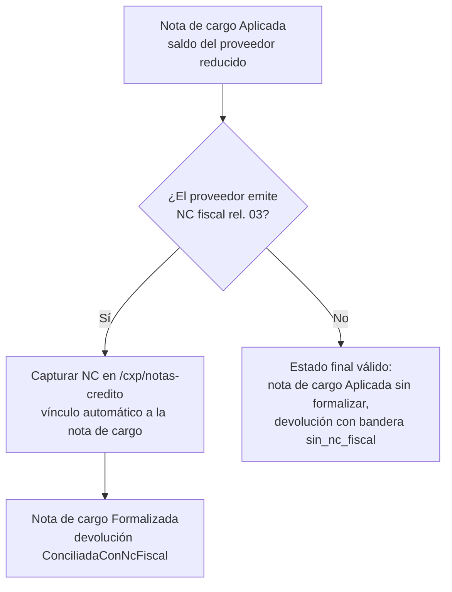

# P3 — Devolución a proveedor (sub-flujo 8.B) con nota de cargo y NC fiscal

**Cadena:** Devolución en Almacén → nota de cargo automática en CxP →
autorizar/aplicar → NC fiscal del proveedor (relación CFDI tipo 03) →
formalización → conciliación de la devolución en Almacén.

**Evidencia en dev (2026-07-15):** devolución `M-DEV2026-000001` · nota de cargo
`NCG-2026-000001` ($125.00) · devolución en estado final `ConciliadaConNcFiscal`.

## Objetivo de negocio

Regresar físicamente al proveedor material recibido (defecto, error de surtido)
y cobrar ese importe: la devolución genera automáticamente una **nota de cargo**
(documento interno, no CFDI) que reduce el saldo del proveedor; cuando el
proveedor emite su **nota de crédito fiscal** (CFDI Egreso con relación tipo 03
= Devolución), la nota de cargo se **formaliza** y la devolución queda
**conciliada fiscalmente**.

> No confundir con la devolución **interna** (8.A), que regresa material de un
> área al almacén y no cruza con CxP — ver [P6](p6-flujos-internos-almacen.md).

## Actores y permisos

| Paso | Actor | Permisos requeridos |
|---|---|---|
| Iniciar devolución 8.B | Jefe de Almacén / Supervisor | `almacen.devoluciones-proveedor.iniciar` |
| Autorizar devolución | Dirección | `almacen.devoluciones-proveedor.autorizar` (compartido con `cuentas_por_pagar.notas-cargo.autorizar`) |
| Registrar salida física | Almacenista | `almacen.devoluciones-proveedor.registrar` |
| Autorizar/aplicar nota de cargo | Dirección / Auxiliar de CxP | `cuentas_por_pagar.notas-cargo.autorizar`, `.aplicar` |
| Capturar NC fiscal | Auxiliar de CxP | `cuentas_por_pagar.notas-credito.capturar` |

## Precondiciones

1. Recepción firme previa del material contra OC (la devolución referencia la
   recepción original; se valúa **al costo de la recepción original**).
2. **Evidencia digitalizada** del motivo (fotos, correo del proveedor):
   autorizar exige al menos una evidencia adjunta.
3. El stock a devolver debe tener saldo en la ubicación que se elija en el
   **selector de bins** al registrar la salida — la salida drena la ubicación
   real (rack o ÚNICA) indicada en el form (GAP-4 resuelto en #615).

## Pasos

1. **Iniciar la devolución.** En `/almacen/devoluciones` ("Devoluciones a
   proveedor"), botón **"Nueva devolución a proveedor"** → Sheet: proveedor,
   recepción/OC de origen, líneas a devolver, motivo, evidencias. Queda en
   `Borrador` → al solicitar autorización pasa a `EnAutorizacion`.
   📸 Captura pendiente: Sheet "Nueva devolución a proveedor".
2. **Autorizar.** En el detalle `/almacen/devoluciones/proveedor/$id`, Dirección
   pulsa **"Autorizar"** (o **"Rechazar"** con motivo). Requiere evidencia
   adjunta (`DEV_PROV_AUTORIZAR_SIN_EVIDENCIA` si falta).
3. **Registrar la salida física.** Cuando la mercancía se entrega al proveedor,
   botón **"Registrar salida"** → genera el movimiento de salida y deja la
   devolución `Registrada` (folio `M-DEV2026-000001`).
   📸 Captura pendiente: detalle devolución 8.B con línea de tiempo de estados.

> **Evento emitido:** `OcDevolucionRegistradaEvent` (Almacén → Compras y CxP).
> En CxP **genera automáticamente la `NotaCargo` en `Borrador`**
> (`NCG-2026-000001`, $125.00). En Compras **decrementa la `CantidadRecibida`**
> de la línea devuelta y **reabre la OC** si ya estaba `Cerrada`
> (GAP-5 resuelto en #614).

4. **Autorizar y aplicar la nota de cargo.** En `/cxp/notas-cargo` ("Notas de
   cargo") aparece `NCG-2026-000001` en `Borrador`. Dirección la **autoriza**;
   después se **aplica** al saldo del proveedor (reduce lo que se le debe).
5. **Capturar la NC fiscal del proveedor.** Cuando el proveedor emite su CFDI
   Egreso **con relación tipo 03 (Devolución)** hacia la factura original, el
   Auxiliar la captura en `/cxp/notas-credito` → **"Capturar NC"**. El sistema
   detecta la relación tipo 03 y la vincula a la nota de cargo de la devolución
   → la nota de cargo pasa a **`Formalizada`**.

> **Evento emitido:** `NotaCreditoFiscalDevolucionRecibidaEvent` (CxP → Almacén),
> específico de la relación tipo 03. Almacén marca la devolución
> **`ConciliadaConNcFiscal`** — cierre fiscal del ciclo.
> Nota: este tramo fue reparado el 2026-07-15 (#612): antes, un check constraint
> hacía inalcanzable el estado y el filtro de Service Bus no dejaba pasar la NC.

## Cómo verificar el resultado en cada módulo

| Módulo | Dónde | Qué esperar |
|---|---|---|
| Almacén | `/almacen/devoluciones/proveedor/$id` | `M-DEV2026-000001` en `ConciliadaConNcFiscal`, con "NC fiscal vinculada"; saldo del artículo decrementado |
| CxP | `/cxp/notas-cargo` | `NCG-2026-000001` en `Formalizada`; saldo del proveedor reducido en $125.00 |
| CxP | `/cxp/notas-credito` | NC fiscal aplicada, con relación tipo 03 hacia la factura origen |
| Compras | `/compras/ordenes/$id` | La OC refleja el **decremento de cantidad recibida** en la línea devuelta (GAP-5 resuelto, #614); si la OC ya estaba `Cerrada`, se reabre |

## Variantes y errores esperados

| Situación | Error real (422) | Mensaje |
|---|---|---|
| Autorizar sin evidencia | `DEV_PROV_AUTORIZAR_SIN_EVIDENCIA` | "Autorizar requiere al menos una evidencia adjunta (patrón NotaCargo CxP)." |
| Autorizar fuera de EnAutorizacion | `DEV_PROV_NO_EN_AUTORIZACION` | "Solo se puede autorizar desde EnAutorizacion (estado: {Estado})." |
| Registrar sin autorizar | `DEV_PROV_NO_AUTORIZADA` | "Solo se puede registrar desde Autorizada (estado: {Estado})." |
| Registrar sin movimiento de salida | `DEV_PROV_SIN_MOVIMIENTO` | "Registrar requiere movimiento_salida_id." |
| Conciliar antes de registrar | `DEV_PROV_NO_REGISTRADA` | "Solo se puede conciliar desde Registrada (estado: {Estado})." |
| Autorizar nota de cargo fuera de Borrador | `NCG_NO_AUTORIZABLE` | "Solo notas en Borrador pueden autorizarse (actual: {Estado})." |
| NC sin UUID de relación | `NC_UUID_RELACION_VACIO` | "El UUID de la factura origen (relación CFDI) es obligatorio — el SAT exige relación tipo 01/03/07." |
| Salida sin saldo en la ubicación elegida | — | Falla por saldo inexistente: elegir en el selector de bins la ubicación donde realmente está el stock (GAP-4 resuelto en #615) |
| El proveedor nunca emite NC fiscal | — | La devolución queda `Aplicada` con bandera `sin_nc_fiscal`; la nota de cargo queda `Aplicada` sin formalizar — es un estado final válido |
