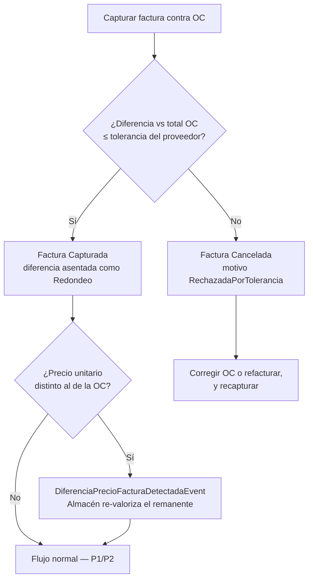

# P4 — Rechazo de factura por exceder tolerancia

**Cadena:** Captura de factura contra OC → la diferencia excede la tolerancia
del proveedor → la factura queda `Cancelada` con motivo `RechazadaPorTolerancia`
→ evento a Compras para corregir la OC.

## Objetivo de negocio

Impedir que se registre un pasivo que no coincide con lo pactado en la OC. Si el
proveedor factura un **precio distinto** al de la orden y la diferencia excede
la tolerancia configurada, el sistema **no permite forzar la captura**: la
factura se rechaza y la corrección ocurre aguas arriba — el Comprador corrige la
OC (cancelar + recrear) o el proveedor refactura.

> Ejemplo con diferencia real de precio: OC por 10 piezas a $100.00
> (total $1,000.00) y factura del proveedor por 10 piezas a $101.00
> (total $1,010.00). Diferencia $10.00 > tolerancia $0.99 → rechazo.
>
> Nota histórica: durante la verificación e2e del 2026-07-15 toda factura con
> IVA se rechazaba aunque coincidiera con la OC, porque la conciliación
> comparaba el total de la OC **sin IVA** contra el total de la factura **con
> IVA**. Eso era el BUG-1, corregido en #611 — hoy solo rechazan las
> diferencias reales de precio, como la de este guion.

## Actores y permisos

| Paso | Actor | Permisos requeridos |
|---|---|---|
| Capturar factura | Auxiliar de CxP | `cuentas_por_pagar.facturas.capturar` |
| Corregir la OC (cancelar + recrear) | Comprador / autorizadores | `compras.ordenes.cancelar` (o `.cancelar-doble` si hubo recepciones), `.crear` |
| Ajustar tolerancia del proveedor (excepcional) | Responsable de CxP | `cuentas_por_pagar.proveedores.ajustar-tolerancia` |

## Precondiciones

1. OC autorizada y CFDI del proveedor en el repositorio (`/cxp/cfdis`).
2. Tolerancia del proveedor conocida: monto absoluto o porcentaje configurado en
   el master de proveedores; si no tiene, aplica el **default global de
   $0.99 MXN**.

## La decisión de un vistazo

La rama del **Sí** es el guion [P2](p2-materiales-directos.md); la rama del
**No** es este guion.

## Pasos

1. **Intentar la captura.** En `/cxp/facturas` → **"Capturar factura"** → Sheet
   "Capturar factura desde OC", igual que en P1/P2, contra la OC con el precio
   viejo.
2. **El sistema rechaza.** La conciliación detecta que la diferencia excede la
   tolerancia. **No devuelve un error 422**: la factura **se crea y se cancela
   en el mismo acto**, quedando en estado **`Cancelada`** con motivo
   **`RechazadaPorTolerancia`** y el texto:
   > "Diferencia {diferencia} contra OC {folio} (total OC {total}) excede
   > tolerancia {tipo} {valor}."

   📸 Captura pendiente: detalle de factura cancelada por tolerancia.

> **Evento emitido:** `FacturaProveedorRechazadaPorToleranciaEvent` (CxP →
> Compras), con la tolerancia aplicada (`{tipo}:{valor}`). Es la señal para que
> el Comprador corrija la OC.

3. **Corregir aguas arriba.** El Comprador revisa el precio: si la OC estaba
   mal, la **cancela** (botón "Cancelar OC", o "Cancelar (doble firma)" si ya
   hubo recepciones) y crea la OC corregida — el botón **"Duplicar OC"**
   prellena desde la cancelada. Si el error es del proveedor, se le pide
   refacturar. La regla de la triada es fija: **el precio del inventario es el
   de la OC** y la diferencia jamás se absorbe en CxP.
4. **Recapturar.** Con la OC corregida (autorizada de nuevo) o el CFDI
   refacturado, el Auxiliar repite la captura → esta vez concilia y sigue el
   flujo normal de [P1](p1-flujo-feliz-insumos.md).

## Cómo verificar el resultado en cada módulo

| Módulo | Dónde | Qué esperar |
|---|---|---|
| CxP | `/cxp/facturas` (filtrar canceladas) | Factura en `Cancelada`, motivo `RechazadaPorTolerancia`, con el texto de la diferencia; **no** generó pasivo ni llegó a Tesorería |
| Compras | `/compras/ordenes/$id` | El sub-estado Facturación de la OC **no** avanzó; notificación del rechazo para el comprador |
| CxP | `/cxp/cfdis` | El CFDI del proveedor sigue disponible para recaptura tras la corrección |

## Variantes y errores esperados

| Situación | Comportamiento |
|---|---|
| Diferencia **dentro** de tolerancia (ej. $0.50 ≤ $0.99) | La captura pasa y la diferencia se asienta como `Redondeo` — ver [P2](p2-materiales-directos.md). Si hay diferencia de precio unitario vs la OC, CxP emite además `DiferenciaPrecioFacturaDetectadaEvent` y Almacén re-valoriza el remanente en stock (GAP-3 resuelto, #617) |
| Proveedor con tolerancia porcentual | Misma mecánica; el texto de cancelación indica `Porcentaje` y el valor |
| Intentar "forzar" la captura | No existe: no hay override en pantalla ni en API; la única vía es corregir OC o refacturar |
| Cancelar OC con recepciones parciales | Exige **doble firma** (`compras.ordenes.cancelar-doble`) |
| Intentar cancelar manualmente una factura ya autorizada | `FACTURA_AUTORIZADA_NO_CANCELABLE` (422) — solo se cancela en `Capturada`/`EnRevision` |
