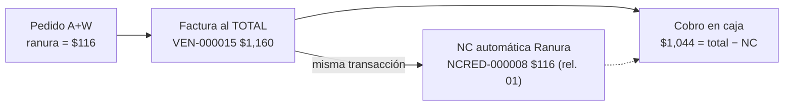
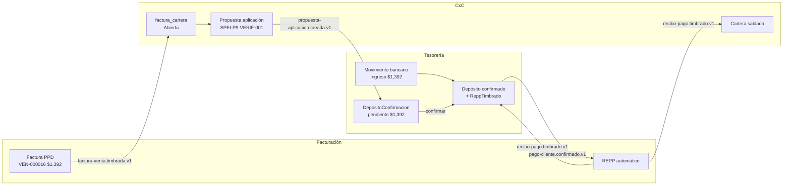

# P9 — Jornada del cajero: Facturación (mostrador) → CxC → Tesorería

**Cadena completa (ingresos):** Apertura de caja → facturas de mostrador en
todas sus variantes (sin ranura, con ranura, con anticipos, PPD con REPP) con
cobro en caja → cierre de caja → expectativa de depósito en Tesorería; en
paralelo, la ruta bancaria: propuesta de aplicación en CxC → confirmación del
depósito en Tesorería → **REPP automático** → cartera saldada.

**Evidencia en dev (2026-07-17), sucursal CONKAL (`CON`), caja CONKAL,
sesión `019f710d-7c0f`:** facturas `VEN-000009/10/11/12/15/16` timbradas,
anticipos `FACANT-2026-000006/7/8`, NC `NCRED-2026-000005..8`, pedidos
manuales `P9-90000001..6`, cierre de caja $4,944.00 conciliado, depósito
bancario propuesto `SPEI-P9-VERIF-001`. Todos etiquetados "P9 verificacion
pipeline (prueba Claude)".

> **Estado (2026-07-17):** el tramo de Facturación de mostrador (6 tipos de
> factura + anticipos + cobros), el cierre de caja y la conciliación del
> depósito de caja en Tesorería quedaron **verificados e2e**. El **REPP
> (CFDI tipo P)** que estaba **BLOQUEADO** (`No mapper found for invoice
> request`, P9-H2) quedó **RESUELTO Y VERIFICADO** (#664): el REPP
> `VEN-000023` timbró en el sandbox (UUID `60b148f4-7742-4c8a-850c-380d7027e4e4`)
> con su `ImpuestosDR` correcto (P9-H8). Los pasos que se habían dejado
> pendientes por el bloqueo — cobro del REPP de mostrador en caja y
> confirmación del depósito **bancario** de la ruta CxC (que dispara el REPP
> automático) — ya se pueden completar; la corrida original los documenta como
> pendientes por el bloqueo de ese momento.

> ⚠️ El timbrado en dev usa el **sandbox de FiscalAPI** con identidades de
> prueba (`ConfiguracionPac`): al PAC solo viajan el emisor/receptor de
> pruebas configurados (emisor EKU9003173C9 CP 42501, receptor
> CACX7605101P8 CP 36257 — **deben ser RFC distintos**, P9-H1); los datos
> reales del cliente quedan solo en el snapshot del comprobante. Receptor
> **genérico XAXX no se sustituye** — en dev usar siempre clientes
> nominales (ver Hallazgos).

## Objetivo de negocio

Un cajero de sucursal opera su día completo: abre su caja con fondo, factura
pedidos de mostrador (con las variantes fiscales reales de Millet — ranura
KO_FALZ de A+W, anticipos de clientes, facturas PPD cobradas por complemento
de pago), cobra cada comprobante en efectivo, corta y cierra la caja. El
efectivo declarado viaja a Tesorería como **expectativa de depósito** que se
concilia contra el estado de cuenta bancario. Los cobros de clientes que
entran directo por banco (transferencias) siguen la ruta CxC → Tesorería y
generan el complemento de pago (REPP) **automáticamente** al confirmar el
depósito.

## Actores y permisos

| Paso | Actor | Permisos requeridos |
|---|---|---|
| Abrir/operar caja (sesión, cobros, arqueo) | Cajero | `facturacion.caja.operar` |
| Cerrar caja (liquidación) | Supervisor/cajero autorizado | `facturacion.caja.liquidar` |
| Autorizar apertura de caja ajena / reabrir | Supervisor | `facturacion.caja.supervisar` |
| Capturar pedido manual | Cajero/facturista | `facturacion.pedidos.capturar` |
| Emitir factura / ver bandeja | Facturista | `facturacion.facturas.emitir`, `.leer` |
| Emitir/vincular anticipos | Facturista | `facturacion.anticipos.emitir`, `.vincular` |
| Emitir REPP mostrador | Facturista | `facturacion.repp.emitir` |
| Descartar/reintentar timbrados fallidos | Facturista senior | `facturacion.comprobantes.descartar`, `.reintentar-timbrado` |
| Proponer aplicación de pago (CxC) | Analista de cobranza | `cuentas-por-cobrar.aplicacion-pago.proponer` |
| Registrar movimiento bancario / confirmar depósito | Tesorero | `tesoreria.movimientos.registrar`, `tesoreria.depositos.confirmar` |

## Precondiciones (datos maestros y configuración)

1. **Caja activa** con alcance a la sucursal (`/facturacion/cajas`): caja
   CONKAL ligada a sucursal `CON`, usuario cajero asignado. Canales sin
   asignar = comodín (todos los canales de la sucursal).
2. **Zona horaria IANA de la sucursal** (`compartido.sucursales.zona_horaria`,
   `America/Merida`) — define el día de operación de la sesión.
3. **Series CFDI activas por sucursal**: `VEN` (venta — el REPP reutiliza la
   serie Cfdi), `NCRED` (NC — la usa la NC de ranura y las de amortización),
   `FACANT` (anticipos).
4. **ConfiguracionPac** con CSD + identidades sandbox capturadas (dev) —
   sin ella el timbrado falla visible.
5. **`Facturacion__ReppAutomatico__SucursalClave = CON`** (appservice.bicep):
   sucursal emisora de los REPP automáticos de cobros bancarios.
6. **Clientes nominales** en el master (`compartido.clientes`) — para
   anticipos el receptor es siempre nominal; en dev sandbox también las
   facturas (el genérico XAXX no pasa el PAC de pruebas, ver Hallazgos).
7. **Pedidos facturables** en estado `Importado`: ingesta A+W
   (`aw_solicitud_pedido`) o captura manual (`POST /pedidos-facturables`).
   La **ranura** (`KO_FALZ`) solo viene de la ingesta A+W — para esta
   verificación se simuló con un UPDATE autorizado sobre el pedido manual
   `P9-90000002` (`ranura = 116.00`).
8. **Cuenta bancaria de Tesorería** activa (seed) para movimientos de ingreso.

## Pasos

### Fase 0 — Apertura de caja

1. **Cerrar el día anterior si quedó colgado.** `GET /cajas/sesion-actual`
   marca `diaAnteriorPendiente: true` si hay una sesión abierta de otro día.
   Se cierra con arqueo → cierre (el sistema la marca `cierreExtemporaneo`).
   Evidencia: sesión `019f5d75` del 13-jul cerrada extemporánea con $0.
2. **Abrir sesión.** En "Mi caja", abrir con fondo de apertura
   (`POST /cajas/{id}/sesiones`, `{sucursalId, fondoApertura: 1000}`). Genera
   el movimiento `FondoApertura` $1,000 y publica
   `facturacion.caja-sesion.abierta.v1`. Evidencia: sesión `019f710d-7c0f`,
   día 2026-07-17.

### Fase 1 — Factura sin ranura (mostrador PUE)

3. **Capturar el pedido** (o tomarlo de la ingesta A+W): `P9-90000001`,
   cliente mostrador, canal Tienda, 2 × $250 = $500 + IVA.
4. **Emitir la factura PUE** (`POST /facturas` con `pedidoFacturableId`,
   `metodoPago: PUE`, `formaPago: 01`). Timbra en una operación (D11).
   Evidencia: `VEN-000009`, UUID `ae74b0e5`, **$580.00**.
5. **Cobrar en caja** (`POST /cobros`, forma `01` efectivo por el total).
   El cobro entra a la sesión abierta del cajero como movimiento
   `CobroCliente` y publica `facturacion.cobro-mostrador.registrado.v1`
   (CxC lo aplica a cartera). Evidencia: cobro `019f7117-f730`, $580.

### Fase 2 — Factura con ranura (KO_FALZ)

La ranura es un descuento de cabecera **bruto (con IVA)** que viene del
pedido A+W. Regla fiscal Millet: la factura se emite **por el total** y la
ranura se documenta con una **NC automática** (motivo Ranura, relación 01)
timbrada en la misma transacción. El cajero no hace nada distinto.

6. **Pedido con ranura**: `P9-90000002`, 4 × $250 = $1,000 + IVA,
   `ranura = 116.00`.
7. **Emitir la factura** — la respuesta trae `notaCreditoRanura`. Evidencia:
   `VEN-000015` **$1,160.00 al total** + NC `NCRED-2026-000008` **$116.00**
   (UUID `fe3d62be`).
8. **Cobrar el neto**: la caja exige `total − NC acreditadas`
   ([Decisión 13-K]) — cobro de **$1,044.00** (cobrar $1,160 falla con
   `COBRO_TOTAL_NO_COINCIDE`).

### Fase 3 — Anticipos (FANT) y su aplicación

9. **Emitir anticipos PUE** (`POST /anticipos`, receptor **nominal**,
   `montoBase` sin IVA) y **cobrarlos en caja** como cualquier comprobante.
   Evidencia: `FACANT-2026-000006` ($580), `-000007` ($290), `-000008`
   ($290), los tres timbrados y cobrados en efectivo.
10. **Factura con UN anticipo**: en la emisión va
    `anticipos: [{anticipoId, importe: 580}]`. Tras timbrar, el sistema
    autogenera y timbra **una NC de amortización (relación 07)** y reduce el
    saldo del anticipo, todo en la misma transacción. Evidencia:
    `VEN-000010` $1,160 + NC `NCRED-2026-000005` $580 → saldo del anticipo
    A = $0. **Cobro neto en caja: $580.**
11. **Factura con DOS anticipos**: mismo array con dos elementos. Evidencia:
    `VEN-000011` $1,160 + NC `NCRED-2026-000006` y `-000007` ($290 c/u) →
    saldos B y C = $0. **Cobro neto: $580.**

> El anticipo debe estar `Timbrado` para aplicarse
> (`ANTICIPO_CFDI_NO_TIMBRADO`). La vinculación previa sin amortizar
> (`POST /anticipos/{id}/vincular`) es el "Momento 2" opcional.

### Fase 4 — Aplicación de pago en mostrador (PPD → REPP)

Una factura PPD **no se cobra directo** en caja (`COBRO_FACTURA_PPD`): el
cobro se documenta con el complemento de pago (REPP) y **el REPP es lo que
se cobra** en la sesión.

12. **Emitir la factura PPD** (`metodoPago: PPD`, `formaPago: 99` — matriz
    SAT validada pre-folio). Evidencia: `VEN-000012` $870.00 (pedido
    `P9-90000005`), timbrada, en cartera con saldo $870.
13. **Emitir el REPP** (`POST /repp`: `fechaPago` **en UTC**,
    `formaPagoReal: 01`, `facturas: [{facturaVentaId, importePagado}]`).
    ✅ **RESUELTO (P9-H2/P9-H8, #664)**: la corrida original falló con
    `No mapper found for invoice request`, pero tras el fix el REPP timbra.
    Evidencia (2026-07-17): re-emisión de `VEN-000012` → REPP `VEN-000023`
    **Timbrado**, UUID `60b148f4-7742-4c8a-850c-380d7027e4e4`, con
    `ImpuestosDR` correcto (ObjetoImpDR 02, base 750, IVA 120). Los REPP
    fallidos previos quedaron en estado Descartada y no consumen saldo.
14. **Cobrar el REPP en caja** (`POST /cobros` con `comprobanteId` del
    REPP): entra a la sesión por `ReciboPago.ImporteTotalPago`. Ya
    desbloqueado (paso 13); la corrida original no lo alcanzó a ejecutar.

### Fase 5 — Corte y cierre de caja → Tesorería

15. **Arqueo** (`POST /cajas/sesiones/{id}/arqueo`, If-Match): congela el
    esperado por forma de pago y pasa a `EnArqueo`. Evidencia: efectivo
    teórico forma `01` = **$4,944.00** (fondo $1,000 + $3,944 de los 7
    cobros en efectivo).
16. **Cierre** (`POST /cajas/sesiones/{id}/cierre`, permiso `liquidar`):
    `{efectivoDeclarado, notasCierre}`. `diferencia = declarado − teórico`
    (solo efectivo `01`). Publica **`facturacion.caja-sesion.cerrada.v1`**.
    Evidencia: declarado **$4,944.00**, diferencia **$0.00**, sesión
    `Cerrada`. *(Cerrada sin el cobro del REPP de mostrador porque en la
    corrida original P9-H2 estaba abierto; ya resuelto, #664.)*
17. **Tesorería proyecta la expectativa**: el `FacturacionEventListenerWorker`
    crea una `DepositoConfirmacion` de origen caja por el efectivo declarado
    (idempotente por `cajaSesionId`). Evidencia: depósito `019f7190-95e3`,
    monto esperado $4,944.00, ref `CAJA 2026-07-17`.
18. **Conciliar el depósito de la caja**: registrar el movimiento bancario
    de ingreso del depósito físico y confirmar la expectativa en
    `/tesoreria/depositos` (`X-Expected-Version`). La liga de caja **no**
    dispara REPP (el mostrador ya timbró los suyos). Evidencia: movimiento
    `019f7190-da1d` $4,944.00 → depósito **Confirmado** (`reppTimbrado`
    n/a).

### Fase 6 — Ruta bancaria (CxC → Tesorería → REPP automático)

Para cobros que entran por transferencia (sin caja):

19. **Factura PPD timbrada** → CxC la proyecta a cartera
    (`factura_cartera`, estado Abierta). Evidencia: `VEN-000016` $1,392
    (AGACOR, pedido `P9-90000006`).
20. **Propuesta de aplicación en CxC**
    (`POST /cuentas-por-cobrar/propuestas-aplicacion`: cliente, referencia
    del depósito, monto, facturas con parcialidad). Publica
    `cuentas_por_cobrar.propuesta-aplicacion.creada.v1`. Evidencia:
    propuesta `019f712f-acd1`, ref `SPEI-P9-VERIF-001`.
21. **Tesorería recibe la propuesta** como `DepositoConfirmacion` pendiente
    en su bandeja (worker `CuentasPorCobrarEventListenerWorker`). Evidencia:
    depósito `019f712f-b0ca`, $1,392.
22. **Registrar el movimiento bancario de ingreso** (RN-6: solo sentido
    Ingreso liga). Evidencia: movimiento `019f7131-4097`, $1,392, ref
    `SPEI-P9-VERIF-001`.
23. **Confirmar el depósito** (`POST /tesoreria/depositos/{id}/confirmar`
    con `movimientoBancarioId`): publica
    **`tesoreria.pago-cliente.confirmado.v1`**. **No ejecutado en la corrida
    original** porque dispara el REPP automático (paso 24, CFDI tipo P) que en
    ese momento fallaba con `No mapper found` (P9-H2). Con P9-H2 resuelto
    (#664, timbrado tipo P verificado) ya se puede confirmar el depósito
    `019f712f-b0ca` y ejercitar el paso 24 de punta a punta.
24. **REPP automático**: Facturación consume el evento y emite el REPP solo
    (sucursal por `ReppAutomatico:SucursalClave`, forma de pago real del
    movimiento). El `recibo-pago.timbrado.v1` resultante **aplica el pago a
    cartera en CxC** (factura → Pagada) y marca `ReppTimbrado` en el
    depósito de Tesorería. Desbloqueado por #664 (el timbrado tipo P ya
    funciona); la corrida original no lo ejercitó por el paso 23.

## Variantes y errores esperados

- **Caja ajena**: abrir la caja de otro usuario exige autorización consumible
  del supervisor (`POST /cajas/{id}/autorizaciones-apertura`, vigencia 30 min,
  un solo uso).
- **Cobro con monto equivocado** → `COBRO_TOTAL_NO_COINCIDE` (el esperado es
  total − NC acreditadas). Factura PPD directa → `COBRO_FACTURA_PPD`. Moneda
  extranjera → `COBRO_MONEDA_INVALIDA` (caja solo MXN).
- **Timbrado fallido**: el comprobante queda `TimbradoFallido` con el error
  del PAC visible; se corrige el dato y se **reintenta**
  (`/comprobantes/{id}/reintentar-timbrado`) o se **descarta** (quema el
  folio y libera el pedido — G3). Esta corrida usó ambos flujos de verdad
  (VEN-000006/7/8/13/14 descartadas).
- **Sesión de otro día abierta** → cerrar extemporáneo antes de abrir la del
  día (`SESION_CAJA_YA_ABIERTA` si se intenta abrir con una viva).
- **Rechazo de la propuesta en Tesorería**: publica
  `propuesta-aplicacion.rechazada.v1`, pero **CxC aún no lo consume**
  (T-G7, PLATFORM-TODO `<PropuestaRechazadaConsumerCxC>`) — hoy se refleja
  con el endpoint interino de CxC.

## Cómo verificar el resultado

- **Facturación**: `/facturacion/facturas` — VEN-000009/10/11/12/15/16
  timbradas con sus NC hijas en el árbol de documentos
  (`/pedidos-facturables/{id}/arbol-documentos`).
- **Caja**: detalle de la sesión (`GET /cajas/sesiones/{id}`) — movimientos
  `FondoApertura` + 7 `CobroCliente`; corte congelado tras el cierre.
- **CxC**: `factura_cartera` — PUE saldadas por cobro mostrador
  (`monto_pagado` = cobro, `monto_nc` = NC ranura/amortización); PPD
  saldadas por REPP.
- **Tesorería**: `/tesoreria/depositos` — expectativa de caja y propuesta
  bancaria confirmadas contra sus movimientos; `repp_timbrado = true` en la
  bancaria.

## Hallazgos de la verificación (2026-07-17)

- **P9-H7 (ABIERTO, mayor — bug de plataforma, fix pendiente de revisión)**:
  el `IIntegrationEventBuffer` es **scoped y compartido entre todos los
  DbContext** del request; el `OutboxSaveChangesInterceptor` drena todo el
  buffer en cada `SaveChanges` y lo inserta en la tabla outbox **del
  contexto que disparó ese SaveChanges**. En una factura que amortiza
  **2+ anticipos**, el timbrado de la NC N+1 (SaveChanges de
  `IntegracionesFiscalDbContext`) drena el evento `nota-credito.timbrada.v1`
  de la NC N y lo escribe en `integraciones_fiscal.integration_events_outbox`
  en vez de `facturacion` → CxC no lo recibe. Evidencia: `VEN-000011`
  (2 anticipos) quedó con **saldo fantasma $290** en `factura_cartera`
  (solo 1 de las 2 NC rel. 07 aplicada); la NC perdida `NCRED-000006`
  apareció en el outbox de integraciones_fiscal. Impacto: cualquier flujo
  que encole un evento y luego haga SaveChanges en otro DbContext antes del
  contexto dueño. Ver memoria `outbox-buffer-cross-context-bug`.
- **P9-H1 (corregido — config dev)**: emisor y receptor sandbox de la
  `ConfiguracionPac` eran el mismo RFC (EKU9003173C9); un CFDI tipo P con
  emisor==receptor no lo mapea FiscalAPI. Se cambió el receptor sandbox a
  `CACX7605101P8` (XOCHILT CASAS CHAVEZ). Las facturas de ingreso lo
  toleraban; el REPP no.
- **P9-H2 (RESUELTO Y VERIFICADO EN DEV — #664)**: el
  `500 — No mapper found for invoice request` era un **error de ruteo del
  payload**, no del concepto ni de las identidades sandbox. El SDK de
  FiscalAPI expone `Invoice.Payments` (plural, lado respuesta) **y**
  `Invoice.Complement.Payment` (singular); el endpoint unificado
  `/api/v4/invoices` **solo lee `Complement.Payment`**. El adapter mandaba el
  complemento en `Invoice.Payments` con `Complement=null` (y `Items` con el
  concepto de pago, que el ejemplo oficial por-valores omite) → el PAC no
  encuentra el mapper del pago → 500 genérico. Confirmado en App Insights
  (`test.fiscalapi.com POST /api/v4/invoices` 500, traces VEN-19/20/22, ésta
  ya con emisor≠receptor) y contra el ejemplo oficial
  `PaymentComplementInvoiceValueForm.cs` de FiscalAPI. **Fix (Parte 1):**
  `FiscalApiTimbradoAdapter.MapInvoice` rutea el pago a `Complement.Payment`
  y no manda `Items` en tipo P; los toggles #659/#660/#662 del concepto eran
  red herrings. Bloqueaba REPP mostrador y REPP automático de la ruta bancaria.
  **Verificado (2026-07-17):** re-emisión de `VEN-000012` → REPP `VEN-000023`
  **Timbrado**, UUID `60b148f4-7742-4c8a-850c-380d7027e4e4`.
- **P9-H8 (RESUELTO Y VERIFICADO EN DEV — #664)**: junto con P9-H2 se corrigió el
  desglose del DoctoRelacionado. Antes `MapPayment` hardcodeaba
  `TaxObjectCode="01"` sin `PaidInvoiceTaxes`, aunque la factura pagada tuviera
  IVA; el Pago 2.0 exige `ObjetoImpDR="02"` + `ImpuestosDR` (base/tasa) cuando
  el CFDI relacionado es objeto de impuesto. **Fix (Parte 2):**
  `ReciboPagoFactura` ahora captura el desglose de impuestos de la factura
  pagada (nueva tabla `recibo_pago_factura_impuesto` + columnas
  `objeto_imp_dr`/`equivalencia`/`base_gravable_pagada`), prorrateado al
  importe pagado (factor = importePagado/total, 6 decimales), con soporte de
  tasas mixtas y retenciones IVA/ISR; `MapPayment` emite `PaidInvoiceTaxes` +
  `Subtotal` + `Equivalence` + `TaxObjectCode`. Migration
  `ReciboPagoFacturaImpuestosDr`. **Verificado (2026-07-17):** el REPP
  `VEN-000023` persistió `objeto_imp_dr=02`, `equivalencia=1`,
  `base_gravable_pagada=750` y un `ImpuestosDR` `002/Tasa/0.16/T` con
  `base_dr=750`, `importe_dr=120` (factor 870/870=1 sobre VEN-000012).
- **P9-H3 (resuelto por #664, verificación e2e pendiente)**:
  `POST /comprobantes/{id}/reintentar-timbrado` de un **ReciboPago** tronaba
  con 500 (`ArgumentException: Static field requires null instance...`). El
  hallazgo se observó **antes** del deploy de #664 a dev. Investigación
  posterior (#667): el flujo NO reproduce en el código actual — verificado
  exhaustivamente con la query `Include(FacturasPagadas).ThenInclude(Impuestos)`
  en InMemory + traducción/materialización Npgsql con filas reales, y el
  **handler completo contra Postgres real** (REPP fallido sembrado con
  ImpuestosDR → timbra OK). El endpoint solo hace `mediator.Send` (sin filtro
  de alcance de cajas) y no hay `Expression.Field`/reflexión en la ruta ni en
  el adapter FiscalAPI. Causa: #664 añadió el `.ThenInclude(f => f.Impuestos)`
  al reintento REPP (alimenta al mapper con los mismos datos que la emisión,
  verificada e2e) y reescribió el mapper. #667 agrega el test de regresión que
  faltaba (el reintento REPP no tenía cobertura). **Cierre formal:** reintentar
  un REPP fallido real en dev (única ruta no ejercitada en infra real: la
  llamada viva al sandbox FiscalAPI en el reintento, idéntica a la de emisión).
- **P9-H4 (documentado)**: en dev sandbox el receptor genérico XAXX no se
  sustituye hacia el PAC → exige CP 42501 (CFDI40149) y régimen 616 + uso
  S01 (CFDI40158). Regla práctica: **en dev facturar siempre a clientes
  nominales**.
- **P9-H5 (documentado)**: `fechaPago` del REPP debe viajar en **UTC** —
  Npgsql rechaza `DateTimeOffset` con offset ≠ 0 (500 en `POST /repp`).
- **P9-H6 (menor)**: el pedido manual no expone `ranura` (solo ingesta
  A+W) — correcto por diseño, pero limita las pruebas sin A+W; esta corrida
  la simuló con UPDATE autorizado en dev.

> **Nota sobre el saldo fantasma de VEN-000011:** es consecuencia de
> P9-H7, no un error del cobro — el cobro en caja fue correcto ($580 neto).
> Se sanea solo cuando P9-H7 se corrija y se reprocese el evento varado, o
> con un ajuste manual de cartera.
