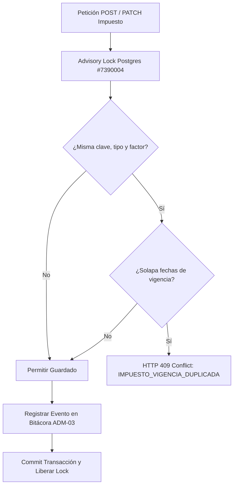

# F1-ADM-04 · Mantener Catálogos Compartidos

> [!NOTE] Resumen Ejecutivo
> Esta especificación técnica y funcional documenta la implementación de la tarea **F1-ADM-04** consolidada en la rama `main`. Introduce el catálogo compartido de **Referencias de Impuestos** (`ImpuestoReferencia`) con vigencias temporales, control de solapamiento fiscal, trazabilidad por auditoría (ADM-03) e integración con el módulo de administración de empresas.

---

## 1. Contexto y Objetivos de Negocio

El ERP requiere compartir catálogos maestros entre múltiples módulos independientes (Facturación CFDI 4.0, Compras, Cuentas por Pagar, Cuentas por Cobrar y Configuración Multiempresa).

Hasta la integración de esta tarea:
- No existía un catálogo unificado de referencias fiscales de impuestos con control de vigencias.
- Las empresas capturaban valores de tasa IVA de forma manual en texto libre.
- No había validación temporal que impidiera superposición de tasas para el mismo concepto fiscal.

### ⚠️ Límite del Alcance (Importante para QA y Revisión)
> [!WARNING] El catálogo no calcula impuestos
> Las referencias aquí gestionadas son **consultivas y organizacionales**. Este catálogo **NO sustituye el motor de cálculo fiscal de CFDI 4.0 de Facturación**. En la configuración de datos de empresa ([`EmpresaDatosForm.tsx`](file:///c:/Users/uzieltzab/Documents/For_job/vilo_ai_studio/millet-erp/frontend/src/modules/administracion/components/EmpresaDatosForm.tsx)), la selección de una tasa del catálogo es un asistente opcional que pre-llena el campo numérico; la captura manual anterior se preserva intacta.

---

## 2. Arquitectura y Modelo de Datos

### 2.1 Modelo Físico en PostgreSQL (`compartido.impuestos_referencia`)

La tabla reside en el esquema `compartido` y es gestionada a través de EF Core en [`CompartidoDbContext`](file:///c:/Users/uzieltzab/Documents/For_job/vilo_ai_studio/millet-erp/backend/src/Compartido/Infrastructure/Persistence/CompartidoDbContext.cs):

| Columna | Tipo | Nulo | Descripción |
|---|---|---|---|
| `id` | `UUID` (v7) | No | Identificador único del registro |
| `clave` | `VARCHAR(16)` | No | Clave fiscal (ej. `002` para IVA, `001` para ISR) |
| `nombre` | `VARCHAR(128)` | No | Nombre legible (ej. `IVA Tasa General 16%`) |
| `tipo` | `VARCHAR(32)` | No | `Traslado` o `Retención` |
| `factor` | `VARCHAR(16)` | No | `Tasa`, `Cuota` o `Exento` |
| `tasa` | `NUMERIC(18, 6)` | No | Valor numérico (ej. `0.160000` para 16%) |
| `vigente_desde` | `DATE` | No | Fecha inicio de vigencia de la tasa |
| `vigente_hasta` | `DATE` | Sí | Fecha fin de vigencia (`NULL` = vigente indefinidamente) |
| `activo` | `BOOLEAN` | No | Estado administrativo de habilitación |
| `fuente` | `VARCHAR(128)` | No | Procedencia de la tasa (ej. `Propuesta VILO`, `SAT Anexo 20`) |
| `version` | `INTEGER` | No | Concurrencia optimista / ETag |

### 2.2 Migración EF Core
- **Archivo:** [`20260928034727_ImpuestosReferenciaAdm04.cs`](file:///c:/Users/uzieltzab/Documents/For_job/vilo_ai_studio/millet-erp/backend/src/Compartido/Infrastructure/Persistence/Migrations/20260928034727_ImpuestosReferenciaAdm04.cs)
- **Índice único de unicidad:**
  ```sql
  CREATE UNIQUE INDEX ix_impuestos_referencia_clave_tipo_factor_vigente_desde
  ON compartido.impuestos_referencia (clave, tipo, factor, vigente_desde);
  ```

---

## 3. Reglas de Negocio y Control Concurrente



1. **Candado Concurrente Transaccional:**
   Para prevenir *race conditions* donde dos administradores capturen vigencias colisionadas simultáneamente, el backend adquiere un advisory lock a nivel transacción:
   `SELECT pg_advisory_xact_lock(7390004);`
2. **Prevención de Solapamiento Temporal (`EnsureNoOverlapAsync`):**
   No se permite que existan dos registros activos con la misma combinación de `(clave, tipo, factor)` cuyos rangos `[vigente_desde, vigente_hasta]` se crucen. Si esto ocurre, el backend rechaza con:
   ```json
   {
     "code": "IMPUESTO_VIGENCIA_DUPLICADA",
     "message": "Ya existe un registro para la misma clave, tipo y factor con vigencia superpuesta."
   }
   ```
3. **Inmutabilidad de Atributos Clave:**
   En peticiones `PATCH`, los campos `clave`, `tipo` y `factor` son inmutables para no romper trazabilidad histórica. Si un impuesto cambia de tasa o naturaleza, se cierra la vigencia del anterior (`vigente_hasta`) y se da de alta una nueva referencia.

---

## 4. API REST Endpoints

Base: `/api/v1/catalogos/impuestos`

| Método | Endpoint | Permiso Requerido | Descripción |
|---|---|---|---|
| `GET` | `/` | `compartido.catalogos.leer` | Listado con filtros: `?fecha=YYYY-MM-DD` y `?incluirHistorico=true/false` |
| `GET` | `/{id}` | `compartido.catalogos.leer` | Detalle de un impuesto por UUID |
| `POST` | `/` | `compartido.catalogos.administrar` | Alta de nuevo impuesto de referencia |
| `PATCH` | `/{id}` | `compartido.catalogos.administrar` | Modificación de nombre, vigencia fin, estado activo o fuente |

---

## 5. Implementación en Frontend (Vite + React)

### 5.1 Pantalla Principal ([`ImpuestosPage.tsx`](file:///c:/Users/uzieltzab/Documents/For_job/vilo_ai_studio/millet-erp/frontend/src/modules/catalogos/components/ImpuestosPage.tsx))
- **Ruta TanStack Router:** `/_app/admin/catalogos/impuestos/`
- **Componentes clave:**
  - Selector de fecha de consulta: por defecto inicializado con `hoyLocalISO()`.
  - Checkbox para alternar entre sólo vigentes activos vs. todo el historial.
  - Tabla de resultados con columnas formateadas y badge de estado.
  - Formulario de alta (`Nueva referencia`) y formulario de edición (`Editar`).

### 5.2 Integración en Navegación ([`admin.ts`](file:///c:/Users/uzieltzab/Documents/For_job/vilo_ai_studio/millet-erp/frontend/src/modules/catalogos/admin.ts#L143-L154))
- Aparece dentro del **Hub de Administración (`/admin`)** bajo el grupo `catalogos`:
  - **Título:** Impuestos
  - **Icono:** `Percent` (`%`)
  - **Permiso:** `compartido.catalogos.leer`

### 5.3 Asistente en Datos de Empresa ([`EmpresaDatosForm.tsx`](file:///c:/Users/uzieltzab/Documents/For_job/vilo_ai_studio/millet-erp/frontend/src/modules/administracion/components/EmpresaDatosForm.tsx#L177-L199))
- En la pestaña de configuración fiscal de la empresa, el campo de tasa IVA por defecto incluye un selector que consulta las tasas vigentes activas y pre-puebla el valor en el formulario.

---

## 6. Guía de Pruebas y Validación para QA

### Escenario 1: Seguridad y Permisos
| Paso | Acción | Resultado Esperado |
|---|---|---|
| 1.1 | Iniciar sesión con usuario sin permisos de catálogo | Al intentar abrir `/admin/catalogos/impuestos`, el router redirige a `/`. La tarjeta no aparece en `/admin`. |
| 1.2 | Iniciar sesión con rol de consulta (`compartido.catalogos.leer`) | Puede ver la tabla y filtrar por fecha, pero el botón "Nueva referencia" y los botones "Editar" están ocultos. |
| 1.3 | Iniciar sesión con rol administrador (`compartido.catalogos.administrar`) | Botones "Nueva referencia" y "Editar" completamente visibles y operativos. |

### Escenario 2: Alta de Referencia
| Paso | Acción | Resultado Esperado |
|---|---|---|
| 2.1 | Clic en "Nueva referencia" | Se despliega el formulario modal/inline de captura. |
| 2.2 | Capturar: Clave=`002`, Nombre=`IVA Frontera 8%`, Tipo=`Traslado`, Factor=`Tasa`, Tasa=`0.08`, VigenteDesde=`2026-01-01`, Fuente=`Propuesta VILO` | Formulario valida campos numéricos y fechas. |
| 2.3 | Presionar "Guardar" | Notificación toast *"Referencia creada"*, se cierra el formulario y la tabla se actualiza automáticamente. |

### Escenario 3: Validación Anti-Solapamiento (HTTP 409)
| Paso | Acción | Resultado Esperado |
|---|---|---|
| 3.1 | Intentar registrar otra referencia con Clave=`002`, Tipo=`Traslado`, Factor=`Tasa` cuya vigencia coincida con la anterior | El sistema rechaza la solicitud. |
| 3.2 | Observar retroalimentación en UI | Notificación toast de error: *"Ya existe un registro para la misma clave, tipo y factor con vigencia superpuesta."* (no se rompe la aplicación). |

### Escenario 4: Filtro Temporal
| Paso | Acción | Resultado Esperado |
|---|---|---|
| 4.1 | Crear una referencia con `vigente_desde` en el futuro (ej. 2027-01-01) | El registro queda guardado en base de datos. |
| 4.2 | Consultar con fecha de hoy y "Incluir historial" desmarcado | El registro futuro **no** aparece en la lista. |
| 4.3 | Marcar "Incluir historial e inactivos" | El registro futuro aparece correctamente en el listado. |

### Escenario 5: Trazabilidad en Auditoría (ADM-03)
| Paso | Acción | Resultado Esperado |
|---|---|---|
| 5.1 | Crear o modificar una tasa de impuesto | Operación completada con éxito. |
| 5.2 | Navegar a `/admin/auditoria` | Aparece el evento con entidad `ImpuestoReferencia`, nombre del usuario autenticado, hora local y snapshot de cambios. |

---

## 7. Pendientes para Aprobación con Vidrios Millet (UAT)

1. **Validación de Catálogo Real SAT:** Confirmar la lista definitiva de claves e impuestos requeridos para ventas y compras (IVA 16%, IVA 8% Fronterizo, IVA 0%, Retención IVA 4%, Retención ISR 1.25%, IEPS).
2. **Definición de Gobernanza:** Acordar con el área contable de Millet quién tendrá el perfil autorizado para modificar o crear vigencias de impuestos en producción.
3. **Fase Posterior:** Evaluar si en una fase futura este catálogo pasará a gobernar de forma obligatoria los cálculos de comprobantes de facturación o continuará como catálogo de referencia.
