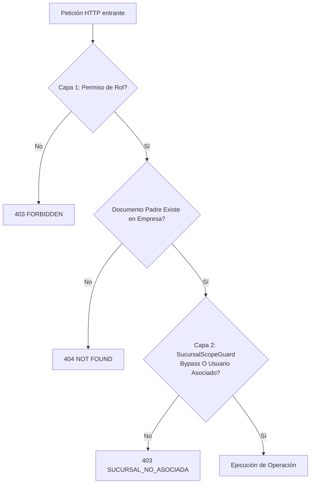
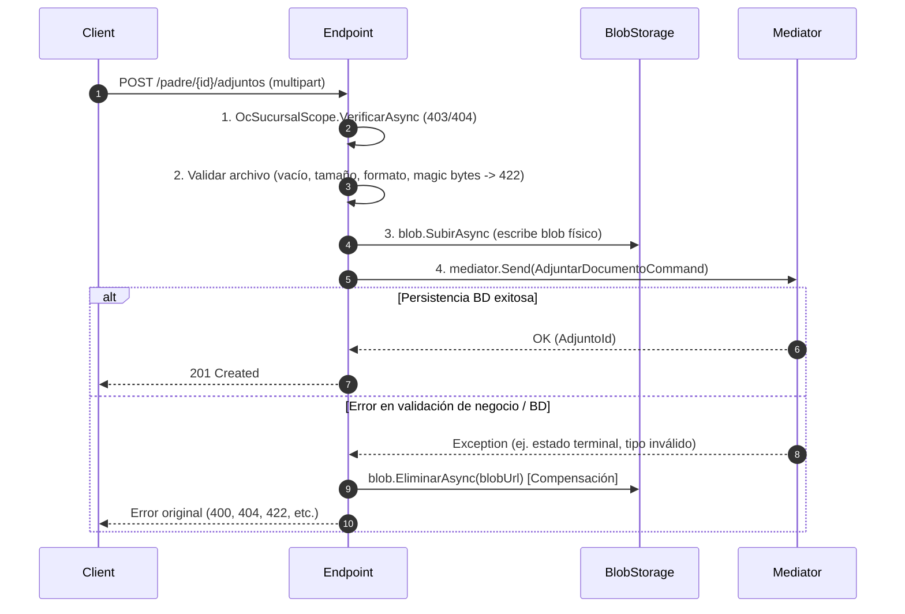

# Contrato de Adjuntos con Control de Acceso (F1-ADM-11)

- **Estado**: Aceptado / En vigor
- **Fecha**: 2026-10-02
- **Ámbito**: Transversal (Administración, Compras, Almacén, Cuentas por Pagar, Tesorería)
- **Documento base**: ADR-0024 (Almacenamiento de documentos), ADR-0051 (Segmentación de datos por sucursal)

---

## 1. Alcance y Definición de "Documento Padre"

Este contrato establece el estándar arquitectónico y de seguridad para subir, listar, consultar el contenido y eliminar archivos adjuntos vinculados a entidades del ERP.

### ¿Qué es un "Documento Padre"?
El documento padre es la entidad raíz de agregado de negocio que gobierna el ciclo de vida, la pertenencia a empresa y el alcance territorial (sucursal) del archivo adjunto.
Ejemplos canónicos:
- `OrdenCompra` en el módulo de Compras (`SucursalDestinoId`).
- `Requisicion` en Compras.
- `Recepcion` / `SalidaAlmacen` en Almacén.
- `ComprobanteGasto` / `FacturaProveedor` en Cuentas por Pagar.

**Principio fundamental de seguridad:** Los adjuntos no tienen existencia independiente ni autorización propia aislada; heredan en su totalidad el contexto de seguridad y el alcance por sucursal del documento padre.

---

## 2. Modelo de Datos del Agregado

La persistencia de adjuntos sigue el patrón de entidad hija dependiente:

1. **Clave foránea e integridad referencial:**
   - La tabla de adjuntos vincula directamente a la PK del agregado padre con borrado en cascada (`ON DELETE CASCADE`).
   - Implementa `IBelongsToAggregate<TPadreId>` e `IAuditable` (registrando `CreatedBy`, `CreatedAt`, `EmpresaId`).
2. **Derivación estricta de Sucursal:**
   - **Ningún endpoint ni comando de adjuntos acepta `sucursalId` o `sucursalCodigo` como parámetro del cliente/navegador.**
   - La sucursal se deriva exclusivamente consultando el documento padre en la base de datos dentro del contexto de la empresa actual (`ICurrentEmpresaContext`).

---

## 3. Autorización en Dos Capas

Todo acceso a cualquier operación de adjuntos requiere validar dos capas independientes en orden:

### Capa 1: Permiso de Rol Declarativo (ASP.NET Endpoint Filter)
- Subir adjunto: `{modulo}.{recurso}.adjuntar` (ej. `compras.ordenes.adjuntar`).
- Leer/Descargar adjunto: `{modulo}.{recurso}.leer` (ej. `compras.ordenes.leer`).
- Eliminar adjunto: `{modulo}.{recurso}.crear` o permiso destructivo equivalente definido por el módulo (ej. `compras.ordenes.crear`).

### Capa 2: Alcance por Sucursal del Documento Padre
Implementada mediante un helper de alcance por módulo (ej. `OcSucursalScope`) utilizando `SucursalScopeGuard`:
1. Consulta el `SucursalId` del padre en base de datos. Si el padre no existe en la empresa actual → `404 ORDEN_COMPRA_NO_ENCONTRADA` (o entidad respectiva).
2. Valida la autorización territorial:
   - **Bypass corporativo:** Si el usuario posee el permiso `{modulo}.{recurso}.leer-todas-sucursales` (ej. `compras.ordenes.leer-todas-sucursales` o SuperAdmin), la operación procede.
   - **Operativo:** Si no cuenta con bypass, se comprueba en `IUsuarioSucursalReadPort` que el usuario esté asociado a la sucursal del padre.
   - Si no cumple ninguna de las dos condiciones → lanza `ForbiddenException("SUCURSAL_NO_ASOCIADA", "No tienes acceso a los datos de la sucursal de esta...")` (HTTP 403).

---

## 4. Endpoints Estándar Anidados

Todos los endpoints deben exponerse anidados bajo la ruta del documento padre:

| Verbo | Ruta estándar | Propósito |
|---|---|---|
| `POST` | `/api/v1/{modulo}/{recurso}/{id}/adjuntos` | Subir archivo vía `multipart/form-data` |
| `GET` | `/api/v1/{modulo}/{recurso}/{id}` | Lista de adjuntos expuesta como colección hija en el detalle del padre |
| `GET` | `/api/v1/{modulo}/{recurso}/{id}/adjuntos/{adjuntoId}/contenido` | Stream binario autenticado del archivo |
| `DELETE` | `/api/v1/{modulo}/{recurso}/{id}/adjuntos/{adjuntoId}` | Eliminación física/lógica del adjunto |

### Verificación a través del Padre en Descargas (`contenido`)
El endpoint de descarga no debe recibir únicamente `adjuntoId`; recibe `{id}` (padre) y `{adjuntoId}`:
1. Valida el acceso territorial al padre `{id}`.
2. Consulta que el adjunto exista y pertenezca efectivamente a dicho `{id}` (`a.OrdenCompraId == id && a.Id == adjuntoId`).
3. Si el `adjuntoId` existe pero pertenece a otra orden de compra → `404 OC_ADJUNTO_NO_ENCONTRADO` (previene fugas de enumeración o IDOR).
4. Retorna `Results.Stream` con el `ContentType` y nombre de descarga registrado.

---

## 5. Política Unificada de Formato y Tamaño (`AdjuntosPoliticaOptions`)

La validación de formato, firma y tamaño se centraliza en `SharedKernel` mediante `AdjuntosPoliticaOptions` (`SectionName = "Adjuntos:Politica"`).

- **Tamaño máximo predeterminado:** 20 MB (`20 * 1024 * 1024` bytes).
- **Lista blanca de extensiones:** `.pdf`, `.jpg`, `.jpeg`, `.png`, `.webp`, `.gif`, `.xlsx`, `.xls`, `.docx`, `.doc`, `.txt`.
- **Lista blanca de MIME Types:** `application/pdf`, `image/jpeg`, `image/png`, `image/webp`, `image/gif`, `application/vnd.openxmlformats-officedocument.spreadsheetml.sheet`, `application/vnd.ms-excel`, `application/vnd.openxmlformats-officedocument.wordprocessingml.document`, `application/msword`, `text/plain`.
- **Inspección de Magic Bytes (Firma):**
  - PDF: `%PDF` (`0x25, 0x50, 0x44, 0x46`).
  - PNG: `89 50 4E 47` (`0x89, 0x50, 0x4E, 0x47`).
  - JPEG: `FF D8 FF` (`0xFF, 0xD8, 0xFF`).
- **Errores de validación (HTTP 422 Unprocessable Entity):**
  - `ADJUNTO_TAMANO_EXCEDIDO`: si `longitud > MaxBytes`.
  - `ADJUNTO_FORMATO_NO_PERMITIDO`: si la extensión, el MIME o la firma de cabecera no coinciden con la lista permitida.

> **Nota sobre configuración:** Los valores actuales están configurados bajo la marca `_origen: "CONFIGURACION DE PRUEBA — formatos, tamaño y retención pendientes de confirmar con Millet (F1-ADM-11)"`.

---

## 6. Patrón de Subida Atómica con Compensación

Para evitar blobs huérfanos en storage o registros inconsistentes en base de datos, el endpoint de subida debe ejecutar estrictamente este flujo de 4 pasos:

Efecto del patrón:
- Si falla la autorización territorial (1) o la política de archivo (2): **0 llamadas a Blob Storage y 0 filas en BD**.
- Si falla la inserción en BD (4): **el blob físico se elimina de inmediato** en el bloque `catch` de compensación (0 blobs huérfanos).
- Reintentos tras fallo: cada reintento exitoso genera exactamente 1 blob y 1 fila en base de datos.
- Reenvíos con mismo `Idempotency-Key`: no duplican ni en storage ni en BD.

---

## 7. Contrato de Frontend (`AdjuntosManager`)

El frontend utiliza el componente transversal `<AdjuntosManager />` (`frontend/src/components/erp/adjuntos/AdjuntosManager.tsx`):

1. **Props Clave:**
   - `adjuntos`: Colección de items presentes en el DTO del padre (`id`, `nombreArchivo`, `tamanoBytes`, `contentType`, etc.).
   - `canUpload`: Booleano derivado de la matriz de acciones (`accionAdjuntarDocumento`). Oculta el dropzone y selector si es falso.
   - `canRemove`: Booleano derivado de `accionRemoverAdjunto`. Oculta botones de eliminación si es falso.
   - `resolverContenidoUrl`: Función `(adjunto) => string` que genera la ruta del endpoint autenticado por stream (`/api/v1/.../{id}/adjuntos/{adjuntoId}/contenido`). El manager lo transforma en Object URL (`blob:...`) para preview inline y descarga segura.
2. **Propagación de Errores del Servidor:**
   - Al capturar `ApiError` (422 o 403), el manager presenta el mensaje (`error.problem.title` / `error.message`) tal cual en la alerta visual accesible (`role="alert"`), y el hook dispara `toast.error` con la misma descripción.
3. **Manejo de Acceso Denegado a Nivel Pantalla:**
   - Si la página del documento padre recibe un 403 o 404 en la carga inicial, el `DetalleErrorBoundary` muestra la vista de acceso restringido o no encontrado, impidiendo por completo el montaje del gestor de adjuntos.

---

## 8. Checklist de Pruebas Obligatorio por Consumidor

Cualquier módulo futuro o existente que implemente adjuntos debe incluir las siguientes pruebas automatizadas (tomar como plantilla `AdjuntosOcAlcanceTests` y `AdjuntosOcSubidaTests`):

- [ ] **Nominal de subida y descarga:** Usuario con permisos y sucursal adecuada sube archivo permitido, consulta detalle (aparece en lista) y descarga los bytes idénticos vía endpoint de contenido.
- [ ] **Rechazo territorial (403):** Usuario operativo de la sucursal A intenta ver detalle, subir, descargar o eliminar adjuntos de un padre de sucursal B → recibe `403 SUCURSAL_NO_ASOCIADA` y no se crean filas ni blobs.
- [ ] **Bypass corporativo (200):** Usuario con permiso `{modulo}.{recurso}.leer-todas-sucursales` sin asociación territorial accede exitosamente a padres de cualquier sucursal.
- [ ] **IDOR / Adjunto cruzado (404):** Usar un `adjuntoId` válido de una entidad B contra la URL del padre A → retorna 404 (no filtra datos).
- [ ] **Padre inexistente (404):** Operaciones sobre un `padreId` inexistente retornan 404.
- [ ] **Validación previa a storage (422):** Formato no permitido (.exe) o tamaño > 20 MB retorna 422 `ADJUNTO_FORMATO_NO_PERMITIDO` / `ADJUNTO_TAMANO_EXCEDIDO` sin invocar `blob.SubirAsync` (0 blobs, 0 filas).
- [ ] **Compensación ante fallo de BD:** Si el handler de persistencia falla (ej. estado terminal del padre o FK inválida), el blob subido se elimina en storage (0 filas, 0 blobs).
- [ ] **Conservación de vínculo tras reabrir:** Tras subir el adjunto, una nueva sesión que reabra el padre conserva el vínculo y la descarga íntegra.

---

## 9. Pendientes de Confirmar con Millet

Los siguientes aspectos fueron acordados bajo configuración de prueba y requerirán confirmación comercial/operativa formal con Vidrios Millet:
1. **Límites definitivos:** Tamaño máximo de archivo (actualmente 20 MB de prueba).
2. **Formatos autorizados:** Inclusión o exclusión de formatos CAD (`.dwg`, `.dxf`) o comprimidos (`.zip`) según el proceso de planta.
3. **Política de retención y purga:** Reglas de eliminación definitiva o pase a tier Archive tras N años.
4. **Permiso de eliminación de adjuntos:** En Compras se mantuvo restringido a `compras.ordenes.crear` únicamente en estado Borrador; evaluar si en otros módulos se requiere un permiso específico `{modulo}.{recurso}.eliminar-adjuntos`.

---

## 10. Consumidores Existentes Pendientes de Migración

Los siguientes módulos fueron identificados con patrones previos y quedan como deuda técnica declarada para alinearse a este contrato:
- **Cuentas por Pagar (CxP):** `EvidenciasEndpoints` (requiere migrar a validación con documento padre y GET autenticado por stream).
- **Almacén:** `ValeBlobEndpoints` y packing list (requieren unificar endpoints de contenido auth-gated y política de prueba).
