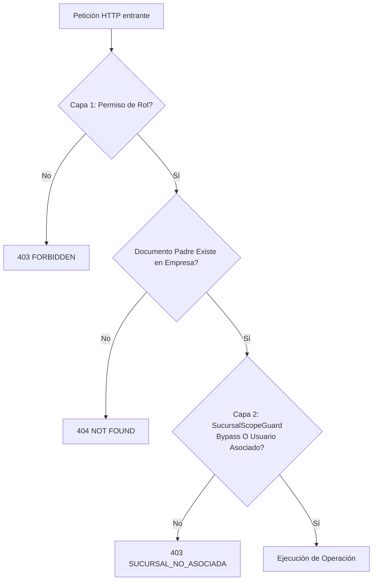
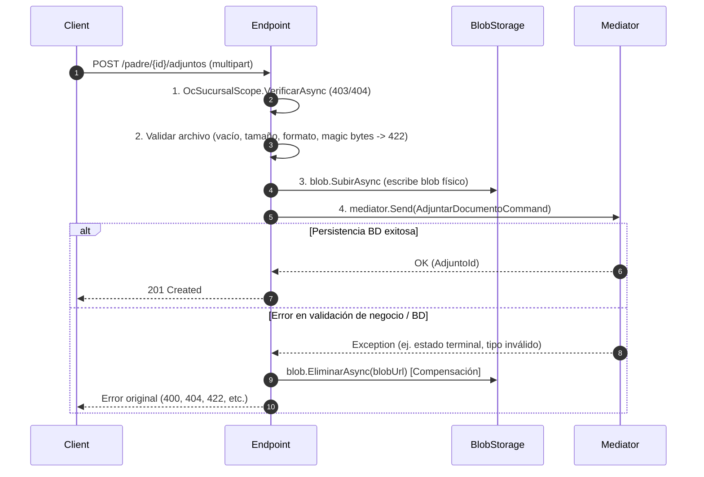

# Contrato de Adjuntos con Control de Acceso (F1-ADM-11)

- **Estado**: Aceptado / En vigor
- **Fecha**: 2026-10-02
- **Ámbito**: Transversal (Administración, Compras, Almacén, Cuentas por Pagar, Tesorería)
- **Documento base**: ADR-0024 (Almacenamiento de documentos), ADR-0051 (Segmentación de datos por sucursal)

---

## 1. Alcance y Definición de "Documento Padre"

Este contrato establece el estándar arquitectónico y de seguridad para subir, listar, consultar el contenido y eliminar archivos adjuntos vinculados a entidades del ERP.

### ¿Qué es un "Documento Padre"?
El documento padre es la entidad raíz de agregado de negocio que gobierna el ciclo de vida, la pertenencia a empresa y el alcance territorial (sucursal) del archivo adjunto.
Ejemplos canónicos:
- `OrdenCompra` en el módulo de Compras (`SucursalDestinoId`).
- `Requisicion` en Compras.
- `Recepcion` / `SalidaAlmacen` en Almacén.
- `ComprobanteGasto` / `FacturaProveedor` en Cuentas por Pagar.

**Principio fundamental de seguridad:** Los adjuntos no tienen existencia independiente ni autorización propia aislada; heredan en su totalidad el contexto de seguridad y el alcance por sucursal del documento padre.

---

## 2. Modelo de Datos del Agregado

La persistencia de adjuntos sigue el patrón de entidad hija dependiente:

1. **Clave foránea e integridad referencial:**
   - La tabla de adjuntos vincula directamente a la PK del agregado padre con borrado en cascada (`ON DELETE CASCADE`).
   - Implementa `IBelongsToAggregate<TPadreId>` e `IAuditable` (registrando `CreatedBy`, `CreatedAt`, `EmpresaId`).
2. **Derivación estricta de Sucursal:**
   - **Ningún endpoint ni comando de adjuntos acepta `sucursalId` o `sucursalCodigo` como parámetro del cliente/navegador.**
   - La sucursal se deriva exclusivamente consultando el documento padre en la base de datos dentro del contexto de la empresa actual (`ICurrentEmpresaContext`).

---

## 3. Autorización en Dos Capas

Todo acceso a cualquier operación de adjuntos requiere validar dos capas independientes en orden:

### Capa 1: Permiso de Rol Declarativo (ASP.NET Endpoint Filter)
- Subir adjunto: `{modulo}.{recurso}.adjuntar` (ej. `compras.ordenes.adjuntar`).
- Leer/Descargar adjunto: `{modulo}.{recurso}.leer` (ej. `compras.ordenes.leer`).
- Eliminar adjunto: `{modulo}.{recurso}.crear` o permiso destructivo equivalente definido por el módulo (ej. `compras.ordenes.crear`).

### Capa 2: Alcance por Sucursal del Documento Padre
Implementada mediante un helper de alcance por módulo (ej. `OcSucursalScope`) utilizando `SucursalScopeGuard`:
1. Consulta el `SucursalId` del padre en base de datos. Si el padre no existe en la empresa actual → `404 ORDEN_COMPRA_NO_ENCONTRADA` (o entidad respectiva).
2. Valida la autorización territorial:
   - **Bypass corporativo:** Si el usuario posee el permiso `{modulo}.{recurso}.leer-todas-sucursales` (ej. `compras.ordenes.leer-todas-sucursales` o SuperAdmin), la operación procede.
   - **Operativo:** Si no cuenta con bypass, se comprueba en `IUsuarioSucursalReadPort` que el usuario esté asociado a la sucursal del padre.
   - Si no cumple ninguna de las dos condiciones → lanza `ForbiddenException("SUCURSAL_NO_ASOCIADA", "No tienes acceso a los datos de la sucursal de esta...")` (HTTP 403).

---

## 4. Endpoints Estándar Anidados

Todos los endpoints deben exponerse anidados bajo la ruta del documento padre:

| Verbo | Ruta estándar | Propósito |
|---|---|---|
| `POST` | `/api/v1/{modulo}/{recurso}/{id}/adjuntos` | Subir archivo vía `multipart/form-data` |
| `GET` | `/api/v1/{modulo}/{recurso}/{id}` | Lista de adjuntos expuesta como colección hija en el detalle del padre |
| `GET` | `/api/v1/{modulo}/{recurso}/{id}/adjuntos/{adjuntoId}/contenido` | Stream binario autenticado del archivo |
| `DELETE` | `/api/v1/{modulo}/{recurso}/{id}/adjuntos/{adjuntoId}` | Eliminación física/lógica del adjunto |

### Verificación a través del Padre en Descargas (`contenido`)
El endpoint de descarga no debe recibir únicamente `adjuntoId`; recibe `{id}` (padre) y `{adjuntoId}`:
1. Valida el acceso territorial al padre `{id}`.
2. Consulta que el adjunto exista y pertenezca efectivamente a dicho `{id}` (`a.OrdenCompraId == id && a.Id == adjuntoId`).
3. Si el `adjuntoId` existe pero pertenece a otra orden de compra → `404 OC_ADJUNTO_NO_ENCONTRADO` (previene fugas de enumeración o IDOR).
4. Retorna `Results.Stream` con el `ContentType` y nombre de descarga registrado.

---

## 5. Política Unificada de Formato y Tamaño (`AdjuntosPoliticaOptions`)

La validación de formato, firma y tamaño se centraliza en `SharedKernel` mediante `AdjuntosPoliticaOptions` (`SectionName = "Adjuntos:Politica"`).

- **Tamaño máximo predeterminado:** 20 MB (`20 * 1024 * 1024` bytes).
- **Lista blanca de extensiones:** `.pdf`, `.jpg`, `.jpeg`, `.png`, `.webp`, `.gif`, `.xlsx`, `.xls`, `.docx`, `.doc`, `.txt`.
- **Lista blanca de MIME Types:** `application/pdf`, `image/jpeg`, `image/png`, `image/webp`, `image/gif`, `application/vnd.openxmlformats-officedocument.spreadsheetml.sheet`, `application/vnd.ms-excel`, `application/vnd.openxmlformats-officedocument.wordprocessingml.document`, `application/msword`, `text/plain`.
- **Inspección de Magic Bytes (Firma):**
  - PDF: `%PDF` (`0x25, 0x50, 0x44, 0x46`).
  - PNG: `89 50 4E 47` (`0x89, 0x50, 0x4E, 0x47`).
  - JPEG: `FF D8 FF` (`0xFF, 0xD8, 0xFF`).
- **Errores de validación (HTTP 422 Unprocessable Entity):**
  - `ADJUNTO_TAMANO_EXCEDIDO`: si `longitud > MaxBytes`.
  - `ADJUNTO_FORMATO_NO_PERMITIDO`: si la extensión, el MIME o la firma de cabecera no coinciden con la lista permitida.

> **Nota sobre configuración:** Los valores actuales están configurados bajo la marca `_origen: "CONFIGURACION DE PRUEBA — formatos, tamaño y retención pendientes de confirmar con Millet (F1-ADM-11)"`.

---

## 6. Patrón de Subida Atómica con Compensación

Para evitar blobs huérfanos en storage o registros inconsistentes en base de datos, el endpoint de subida debe ejecutar estrictamente este flujo de 4 pasos:

Efecto del patrón:
- Si falla la autorización territorial (1) o la política de archivo (2): **0 llamadas a Blob Storage y 0 filas en BD**.
- Si falla la inserción en BD (4): **el blob físico se elimina de inmediato** en el bloque `catch` de compensación (0 blobs huérfanos).
- Reintentos tras fallo: cada reintento exitoso genera exactamente 1 blob y 1 fila en base de datos.
- Reenvíos con mismo `Idempotency-Key`: no duplican ni en storage ni en BD.

---

## 7. Contrato de Frontend (`AdjuntosManager`)

El frontend utiliza el componente transversal `<AdjuntosManager />` (`frontend/src/components/erp/adjuntos/AdjuntosManager.tsx`):

1. **Props Clave:**
   - `adjuntos`: Colección de items presentes en el DTO del padre (`id`, `nombreArchivo`, `tamanoBytes`, `contentType`, etc.).
   - `canUpload`: Booleano derivado de la matriz de acciones (`accionAdjuntarDocumento`). Oculta el dropzone y selector si es falso.
   - `canRemove`: Booleano derivado de `accionRemoverAdjunto`. Oculta botones de eliminación si es falso.
   - `resolverContenidoUrl`: Función `(adjunto) => string` que genera la ruta del endpoint autenticado por stream (`/api/v1/.../{id}/adjuntos/{adjuntoId}/contenido`). El manager lo transforma en Object URL (`blob:...`) para preview inline y descarga segura.
2. **Propagación de Errores del Servidor:**
   - Al capturar `ApiError` (422 o 403), el manager presenta el mensaje (`error.problem.title` / `error.message`) tal cual en la alerta visual accesible (`role="alert"`), y el hook dispara `toast.error` con la misma descripción.
3. **Manejo de Acceso Denegado a Nivel Pantalla:**
   - Si la página del documento padre recibe un 403 o 404 en la carga inicial, el `DetalleErrorBoundary` muestra la vista de acceso restringido o no encontrado, impidiendo por completo el montaje del gestor de adjuntos.

---

## 8. Checklist de Pruebas Obligatorio por Consumidor

Cualquier módulo futuro o existente que implemente adjuntos debe incluir las siguientes pruebas automatizadas (tomar como plantilla `AdjuntosOcAlcanceTests` y `AdjuntosOcSubidaTests`):

- [ ] **Nominal de subida y descarga:** Usuario con permisos y sucursal adecuada sube archivo permitido, consulta detalle (aparece en lista) y descarga los bytes idénticos vía endpoint de contenido.
- [ ] **Rechazo territorial (403):** Usuario operativo de la sucursal A intenta ver detalle, subir, descargar o eliminar adjuntos de un padre de sucursal B → recibe `403 SUCURSAL_NO_ASOCIADA` y no se crean filas ni blobs.
- [ ] **Bypass corporativo (200):** Usuario con permiso `{modulo}.{recurso}.leer-todas-sucursales` sin asociación territorial accede exitosamente a padres de cualquier sucursal.
- [ ] **IDOR / Adjunto cruzado (404):** Usar un `adjuntoId` válido de una entidad B contra la URL del padre A → retorna 404 (no filtra datos).
- [ ] **Padre inexistente (404):** Operaciones sobre un `padreId` inexistente retornan 404.
- [ ] **Validación previa a storage (422):** Formato no permitido (.exe) o tamaño > 20 MB retorna 422 `ADJUNTO_FORMATO_NO_PERMITIDO` / `ADJUNTO_TAMANO_EXCEDIDO` sin invocar `blob.SubirAsync` (0 blobs, 0 filas).
- [ ] **Compensación ante fallo de BD:** Si el handler de persistencia falla (ej. estado terminal del padre o FK inválida), el blob subido se elimina en storage (0 filas, 0 blobs).
- [ ] **Conservación de vínculo tras reabrir:** Tras subir el adjunto, una nueva sesión que reabra el padre conserva el vínculo y la descarga íntegra.

---

## 9. Pendientes de Confirmar con Millet

Los siguientes aspectos fueron acordados bajo configuración de prueba y requerirán confirmación comercial/operativa formal con Vidrios Millet:
1. **Límites definitivos:** Tamaño máximo de archivo (actualmente 20 MB de prueba).
2. **Formatos autorizados:** Inclusión o exclusión de formatos CAD (`.dwg`, `.dxf`) o comprimidos (`.zip`) según el proceso de planta.
3. **Política de retención y purga:** Reglas de eliminación definitiva o pase a tier Archive tras N años.
4. **Permiso de eliminación de adjuntos:** En Compras se mantuvo restringido a `compras.ordenes.crear` únicamente en estado Borrador; evaluar si en otros módulos se requiere un permiso específico `{modulo}.{recurso}.eliminar-adjuntos`.

---

## 10. Consumidores Existentes Pendientes de Migración

Los siguientes módulos fueron identificados con patrones previos y quedan como deuda técnica declarada para alinearse a este contrato:
- **Cuentas por Pagar (CxP):** `EvidenciasEndpoints` (requiere migrar a validación con documento padre y GET autenticado por stream).
- **Almacén:** `ValeBlobEndpoints` y packing list (requieren unificar endpoints de contenido auth-gated y política de prueba).

---

## 11. Servicio genérico (G1.2)

> **Estado de configuración:** formatos, tamaño, vigencias, obligatoriedad, retención y quién da de baja son valores de **PRUEBA — pendiente de validar con Eliam / Millet**. Ver ADR-0058.
>
> **Consumidor piloto legado:** las Órdenes de Compra (§1–§8) son el piloto que dio origen al contrato. Siguen con su tabla propia (`AdjuntoOC`), sus endpoints y su puerto de blob; **no** usan el servicio genérico (PLATFORM-TODO `<MigrarAdjuntosOcAlmacen>`). Todo consumidor nuevo usa el servicio genérico. El primer consumidor genérico es el expediente documental del **Proveedor**.

### 11.1 Modelo

Ambas tablas viven en el esquema `compartido` (`CompartidoDbContext`); las entidades están en `SharedKernel/Domain/Adjuntos/`.

**`Adjunto`** (`compartido.adjuntos`) — un archivo cargado a una entidad de cualquier módulo:

| Campo | Notas |
|---|---|
| `TipoEntidad` + `EntidadId` | Dueño del archivo (`proveedor` + id). Sin FK a la tabla del dueño: es genérico; la integridad la da `IAdjuntoPropietario`. |
| `TipoDocumentoId` | FK lógica a `AdjuntoTipoDocumento`. |
| `NombreArchivo`, `ContentType`, `TamanoBytes`, `HashSha256` | Hash SHA-256 en hex (64), calculado en streaming al subir. El nombre se valida sin ruta. |
| `BlobRef` | Referencia interna al blob (`{tipoEntidad}/{entidadId}/{adjuntoId}{ext}`). **Nunca** sale en un DTO. |
| `VigenteHasta` | `DateOnly?`. Nulo = sin vigencia. |
| `SubidoPorId`, `SubidoEn` | Auditoría de alta. |
| `BajaEn`, `BajaPorId`, `BajaMotivo` | Baja lógica (§11.6). |
| `EmpresaId?` | Nulo cuando la entidad dueña es cross-empresa (Proveedor). |

Implementa `IAuditable` e `IBelongsToAggregate` (`AggregateRootId = EntidadId`): el interceptor de auditoría registra altas y bajas bajo el agregado dueño. Índices `(TipoEntidad, EntidadId)` y `(EntidadId, TipoDocumentoId)`.

**`AdjuntoTipoDocumento`** (`compartido.adjunto_tipos_documento`) — catálogo de tipos por entidad dueña: `TipoEntidad`, `Codigo` (único por entidad), `Nombre`, `Orden`, `Obligatorio`, `VigenciaMeses?` (nulo = sin vigencia), `SoloPersonaMoral`, `Activo`. Los siembra la migración de cada módulo con ids deterministas.

Tipos sembrados de `proveedor` (PRUEBA):

| Código | Obligatorio | Vigencia | Solo persona moral |
|---|---|---|---|
| `constancia_situacion_fiscal` | Sí | 3 meses | No |
| `contrato` | Sí | Sin vigencia | No |
| `acta_constitutiva` | Sí | Sin vigencia | Sí |
| `identificacion_representante_legal` | Sí | Sin vigencia | No |
| `comprobante_domicilio` | Sí | 3 meses | No |

### 11.2 `IAdjuntoPropietario` — autorización heredada del padre

Interfaz en `SharedKernel/Application/Adjuntos/IAdjuntoPropietario.cs`. Cada módulo que adjunta archivos registra **una** implementación por DI; el servicio las toma por `TipoEntidad`.

| Miembro | Para qué |
|---|---|
| `TipoEntidad` | Clave en snake_case; coincide con `Adjunto.TipoEntidad` y con el query `?entidad=` de tipos. |
| `CodigoNoEncontrado` | Código 404 si el padre no existe (p. ej. `PROVEEDOR_NO_ENCONTRADO`). |
| `PermisoVer` / `PermisoSubir` / `PermisoBaja` | Permisos canónicos por operación (ADR-0041). |
| `ResolverAsync(entidadId)` | Devuelve `AdjuntoPropietarioInfo` (`EmpresaId?`, `SucursalId?`, `PuedeSubir`, `EsPersonaMoral?`, `Etiqueta`) o `null` si no existe o no es visible para la empresa actual. |
| `VerificarAlcanceAsync(info)` | Alcance territorial: `SucursalScopeGuard.VerificarAsync` si hay sucursal; sin sucursal no hace nada. Lanza `ForbiddenException` si no hay alcance. |

`AdjuntoAcceso` aplica siempre el mismo orden (contrato §3): tipo de entidad conocido (si no, 404 `ADJUNTO_TIPO_ENTIDAD_DESCONOCIDO`) → permiso de rol (403 `ADJUNTO_PERMISO_DENEGADO`) → existencia del padre (404) → alcance (403 `SUCURSAL_NO_ASOCIADA`) → operación. Las denegaciones se auditan.

### 11.3 Cómo registrar un módulo nuevo

Pasos (ejemplos: pólizas **C1.3**, comercio exterior **CE12.1**, recepciones de Almacén):

1. **Permisos.** Crear tres permisos canónicos por operación en `Identidad/Domain/PermisosCanonicos.cs` (`{modulo}.{recurso}.adjuntos-ver`, `.adjuntos-subir`, `.adjuntos-baja`), añadirlos a `Todos`, con migración seed en Identidad (patrón `SeedPermisosAdjuntosProveedor`) y espejo en `frontend/src/lib/auth/permission-codes.ts` (hay test de sincronía). Si el módulo tiene datos por sucursal, usar además su permiso `…leer-todas-sucursales` existente (ADR-0051).
2. **Propietario.** Implementar `IAdjuntoPropietario` en el módulo (ver `Compartido/Application/Adjuntos/ProveedorAdjuntoPropietario.cs`). Si el módulo no referencia `Identidad`, los permisos van como literales duplicados y un test de integración los cruza con `PermisosCanonicos`. Resolver **siempre** empresa y sucursal desde la base (nunca del cliente):
   - Pólizas (C1.3): `ResolverAsync` consulta la póliza en el contexto de la empresa actual; `EmpresaId` y `SucursalId` de la póliza; `PuedeSubir = false` si está cerrada/cancelada; `VerificarAlcanceAsync` delega en `SucursalScopeGuard` con su permiso de bypass.
   - Comercio exterior (CE12.1): igual con el expediente de operación/pedimento; `SucursalId` de la operación.
   - Recepciones (Almacén): `SucursalId` de la recepción; `PuedeSubir = false` en recepciones canceladas.
   - Entidad cross-empresa (como Proveedor): `EmpresaId = null`, `SucursalId = null`; el aislamiento depende solo del permiso. Documentar la excepción.
3. **Registro DI** en `Api/Program.cs` junto al de Proveedor: `AddScoped<IAdjuntoPropietario, MiPropietario>()`.
4. **Tipos de documento.** Sembrar filas de `AdjuntoTipoDocumento` con `TipoEntidad` del módulo (ids deterministas, `HasData` + migración `Compartido`; se genera, no se aplica a dev sin OK del owner). Definir `Obligatorio`, `VigenciaMeses`, `SoloPersonaMoral`.
5. **Política de archivo** (opcional): override en `Adjuntos:Politica:PorTipoEntidad:{tipo}` de `appsettings` (formatos y tamaño); sin override rige el default global (§5).
6. **Endpoints.** Colgar `MapAdjuntos(tipoEntidad, permisoVer, permisoSubir, permisoBaja)` del grupo del padre (`.../{id:guid}`), como en `DatosMaestrosEndpoints.cs`. `MapAdjuntosGenerales()` (tipos y descarga por enlace) ya está registrado una sola vez.
7. **Pruebas** del checklist §8 adaptadas: 403 sin permiso, 404 padre, IDOR, alcance por sucursal (si aplica), formato/tamaño sin tocar blob, compensación, baja, enlace.
8. **Frontend:** reusar `AdjuntosManager` en modo genérico (`modoBaja`, estados, vigencia) y los hooks de `components/erp/adjuntos/api/`.

### 11.4 Endpoints

Anidados bajo el padre: `/api/v1/{modulo}/{recurso}/{id}/…` (primer uso: `/api/v1/datos-maestros/proveedores/{id}/…`).

| Verbo | Ruta | Permiso | Notas |
|---|---|---|---|
| `POST` | `/adjuntos` | `adjuntos-subir` | `multipart/form-data`: `archivo`, `tipoDocumentoId`, `vigenteHasta?`. `Idempotency-Key` obligatorio. 201. |
| `GET` | `/adjuntos?incluirBajas=` | `adjuntos-ver` | `incluirBajas=true` solo con `adjuntos-baja`. |
| `GET` | `/adjuntos/{adjuntoId}` | `adjuntos-ver` | Metadatos. |
| `GET` | `/adjuntos/{adjuntoId}/contenido` | `adjuntos-ver` | Stream autenticado (para previews del front). Audita la descarga. |
| `POST` | `/adjuntos/{adjuntoId}/enlace` | `adjuntos-ver` | Emite enlace temporal (§11.5). |
| `DELETE` | `/adjuntos/{adjuntoId}` | `adjuntos-baja` | Body `{ "motivo": "…" }`. Baja lógica. |
| `GET` | `/adjuntos/{adjuntoId}/bitacora` | `adjuntos-baja` | Quién/cuándo/qué (reusa `ConsultarBitacoraQuery`). |
| `GET` | `/expediente` | `adjuntos-ver` | Estado por tipo y `completo` (§11.8). |
| `GET` | `/api/v1/adjuntos/tipos?entidad=` | autenticado + permiso de ver de la entidad | Catálogo de tipos. |
| `GET` | `/api/v1/adjuntos/descargas/{token}` | anónimo (el token es la credencial) | Ver §11.5. |

Un `adjuntoId` de otro padre responde 404 `ADJUNTO_NO_ENCONTRADO` (sin IDOR). Ningún DTO ni cabecera expone `BlobRef` ni URL de blob.

### 11.5 Enlace temporal de descarga

1. `POST …/adjuntos/{adjuntoId}/enlace` aplica permiso de ver + padre + alcance y devuelve `{ url, expiraEn }`.
2. El token se genera con `ITimeLimitedDataProtector` (ASP.NET DataProtection, llaves ya persistidas), con propósito dedicado `Millet.Compartido.Adjuntos.EnlaceDescarga.v1`, atado a `adjuntoId` + `usuarioId`. **TTL 60 s** (`Adjuntos:Enlace:TtlSegundos`).
3. `GET /api/v1/adjuntos/descargas/{token}` (`AllowAnonymous`): valida firma y expiración; **re-verifica en BD que el adjunto exista y no esté dado de baja** (si se dio de baja entre emitir y descargar → 404); hace stream y audita ("Descargó '…' por enlace temporal").
4. Token inválido, manipulado o expirado → 401 `ADJUNTO_ENLACE_INVALIDO`.
5. Cabeceras seguras en la respuesta (`Content-Disposition` con nombre saneado).

### 11.6 Vigencia y estado derivado

El estado **no se guarda**; se calcula (`Adjunto.EstadoEn(hoy)`):

| Estado | Condición |
|---|---|
| `Baja` | Tiene baja lógica. |
| `SinVigencia` | `VigenteHasta` nulo. |
| `Vencido` | `VigenteHasta < hoy`. |
| `PorVencer` | `VigenteHasta <= hoy + 30 días`. |
| `Vigente` | Resto. |

- "Hoy" es la **fecha** en `America/Mexico_City` derivada de `IClock` (UTC).
- **Regla 31-oct / 1-nov:** un documento con `VigenteHasta = 31-oct` es `Vigente`/`PorVencer` durante todo el 31-oct y pasa a `Vencido` el 1-nov (criterio G1.2-b).
- Al subir: si viene `vigenteHasta` y es anterior a hoy → 422 `ADJUNTO_VIGENCIA_PASADA`; si no viene y el tipo tiene `VigenciaMeses` → hoy + N meses; si el tipo no tiene vigencia y viene una fecha, se acepta.
- No hay sustitución implícita: un tipo puede tener varios adjuntos; el expediente toma el más reciente sin baja.

### 11.7 Baja lógica

`DELETE …/adjuntos/{adjuntoId}` exige `motivo` de **5 a 500 caracteres** (422 `ADJUNTO_MOTIVO_BAJA_INVALIDO`). Es **irreversible** (una segunda baja → 422 `ADJUNTO_YA_DADO_DE_BAJA`). Guarda `BajaEn`, `BajaPorId`, `BajaMotivo`; el **blob físico no se borra** (retención pendiente, PLATFORM-TODO `<RetencionAdjuntos>`). Las bajas se ven solo con `adjuntos-baja` (`incluirBajas`, bitácora). Un enlace emitido antes de la baja deja de servir (§11.5).

### 11.8 Política por entidad, expediente y puerto de lectura

- **Política por entidad:** `AdjuntosPoliticaOptions.ParaEntidad(tipoEntidad)` aplica el override de `Adjuntos:Politica:PorTipoEntidad:{tipo}`; sin override, el default global (20 MB, §5; OC no cambia). Para `proveedor` (PRUEBA): PDF, XML, JPG, PNG, máximo 10 MB. La validación incluye extensión, MIME y firma; XML se valida por extensión, MIME y primer byte `<` (tras BOM opcional) **sin parsearlo** (sin riesgo XXE).
- **Expediente:** `GET …/expediente` devuelve por tipo aplicable (`acta_constitutiva` solo si persona moral) el estado `Faltante | Vigente | PorVencer | Vencido`, el adjunto actual y `completo`. `Completo` = todos los obligatorios aplicables en `Vigente` o `PorVencer`. Los tipos sin vigencia cuentan como vigentes.
- **`IExpedienteProveedorReadPort`** (`Compartido/Application/Ports`): `ObtenerAsync(proveedorId)` → `ExpedienteProveedorResumen(Completo, Faltantes[], Vencidos[], PorVencer[])`, o `null` si no existe. Es lectura inter-módulo de confianza (sin usuario) para que CxP valide el expediente antes de pasar un proveedor a Activo (G1.1/CA2.2) sin tocar tablas de Compartido. Aún sin consumidor.

### 11.9 Códigos de error

| Código | HTTP | Cuándo |
|---|---|---|
| `ADJUNTO_PERMISO_DENEGADO` | 403 | Falta el permiso de la operación. |
| `SUCURSAL_NO_ASOCIADA` | 403 | Sin alcance sobre la sucursal del padre. |
| `ADJUNTO_TIPO_ENTIDAD_DESCONOCIDO` | 404 | Tipo de entidad sin propietario registrado. |
| `{CodigoNoEncontrado}` (p. ej. `PROVEEDOR_NO_ENCONTRADO`) | 404 | Padre inexistente. |
| `ADJUNTO_NO_ENCONTRADO` | 404 | Adjunto inexistente, de otro padre, o dado de baja al descargar por enlace. |
| `ADJUNTO_TIPO_DOCUMENTO_NO_ENCONTRADO` | 404 | Tipo de documento inexistente para la entidad. |
| `ADJUNTO_ENTIDAD_NO_ADMITE_SUBIDA` | 422 | `PuedeSubir = false` (p. ej. proveedor inactivo). |
| `ADJUNTO_TIPO_NO_APLICA` | 422 | Tipo no aplicable a la entidad (p. ej. acta en persona física). |
| `ADJUNTO_FORMATO_NO_PERMITIDO` | 422 | Extensión, MIME o firma no permitidos. |
| `ADJUNTO_TAMANO_EXCEDIDO` | 422 | Supera el máximo de la política. |
| `ADJUNTO_ARCHIVO_VACIO` | 422 | Archivo vacío. |
| `ADJUNTO_VIGENCIA_PASADA` | 422 | `vigenteHasta` anterior a hoy. |
| `ADJUNTO_MOTIVO_BAJA_INVALIDO` | 422 | Motivo fuera de 5–500 caracteres. |
| `ADJUNTO_YA_DADO_DE_BAJA` | 422 | Baja repetida. |
| `ADJUNTO_ENLACE_INVALIDO` | 401 | Token inválido, manipulado o expirado. |

También existen códigos de validación de entrada (`ADJUNTO_NOMBRE_INVALIDO`, `ADJUNTO_CONTENT_TYPE_INVALIDO`, `ADJUNTO_HASH_INVALIDO`, `ADJUNTO_TAMANO_INVALIDO`, etc.) y `ADJUNTO_ARCHIVO_NO_DISPONIBLE` (blob ausente en storage). Fallos de blob o BD en la subida no dejan fila ni blob huérfano (compensación, §6).

### 11.10 Dependencias de plataforma pendientes (ADR-0031)

| Pieza | Ticket | NoOp / estado actual | Cómo se wirea |
|---|---|---|---|
| Unificar los puertos de blob | `<UnificarBlobPorts>` | Conviven el nuevo `IBlobStoragePort` y tres `IAlmacenarBlobPort` legados (Compras, Almacén, Integraciones.Aw) | Migrar los tres a `IBlobStoragePort` y retirar los duplicados |
| Migrar adjuntos de OC y Almacén al servicio genérico | `<MigrarAdjuntosOcAlmacen>` | OC (`AdjuntoOC`), vale, packing list y evidencias siguen con su patrón propio | Un `IAdjuntoPropietario` por módulo + migración de datos; ver `hallazgos` de la auditoría F2 |
| Antivirus de adjuntos | `<AntivirusAdjuntos>` | No hay escaneo; solo formato/firma/tamaño | Azure Defender for Storage o escaneo previo al `SubirAsync` |
| Retención y purga | `<RetencionAdjuntos>` | Los blobs dados de baja nunca se borran | Política de Millet (años, tier Archive, purga) |
